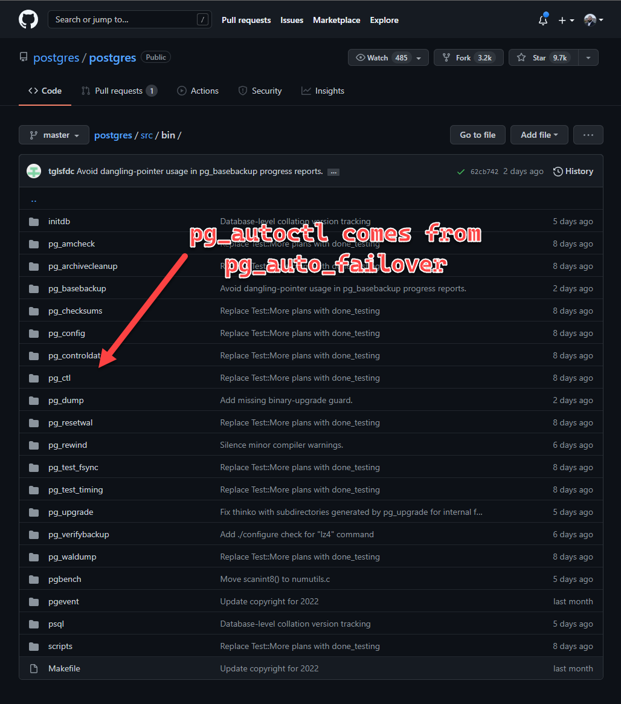

# Tanzu `postgres-for-kubernetes-v1.5.0` 👀
 Deep dive into the Tanzu Postgres Operator to see how it works.

- [x]  **Tear Open Tanzu**
    - [x]  Working E2E in Microk8s
    - [x]  Docker dump out container files & dockerfiles
    - [x]  Pod dump out running logs from HA setup
    - [x]  Log into FSM during HA to understand state machine
    - [x]  See what code can be salvaged 

---

# Hands-on with Tanzu SQL

This repository contains my notes from peeking into the Tanzu SQL Postgres Operator.

---

# **Repo structure**

```
.
├── README.md
├── dockerfiles
│   ├── postgres-instance.Dockerfile
│   └── postgres-operator.Dockerfile
├── dump
│   ├── postgres-instance
│   └── postgres-operator
├── kubernetes
│   ├── backup.yaml
│   ├── backuplocation.yaml
│   ├── postgres-ha.yaml
│   ├── postgres-single
│   └── postgres-single.yaml
├── logs
│   └── postgres-sample-0
├── operator
│   ├── Chart.yaml
│   ├── crds
│   ├── templates
│   ├── values-overrides.yaml
│   └── values.yaml
├── osl
│   ├── open_source_license_VMware_Postgres_11.14.0_GA.txt
│   ├── open_source_license_VMware_Postgres_12.9.0_GA.txt
│   ├── open_source_license_VMware_Postgres_13.5.0_GA.txt
│   ├── open_source_license_VMware_Postgres_14.1.0_GA.txt
│   └── open_source_license_VMware_Tanzu_SQL_with_Postgres_for_Kubernetes_1.5.0_GA.txt
├── samples
│   ├── backup.yaml
│   ├── backuplocation.yaml
│   ├── backupschedule.yaml
│   ├── postgres.yaml
│   └── restore.yaml
└── scripts
    └── deploy.ps1

14 directories, 21 files
```

---

# Microk8s spinup

```powershell
# Single node K8s cluster
microk8s install "--cpu=8" "--mem=64" "--disk=50" "--channel=1.19/stable" -y
```

**Note:** the `microk8s-vm` doesn't want to come up when Docker Desktop is also running for some networking reason - but can turn on Docker Desktop after.

---

Allow privileged container by shelling into Microk8s VM:

```powershell
multipass shell microk8s-vm
# This shells us in

sudo bash -c 'echo "--allow-privileged" >> /var/snap/microk8s/current/args/kube-apiserver'
```

Tanzu Postgres requires the ability to map the host system’s `/sys/fs/cgroup` directory onto each container’s `/sys/fs/cgroup`. Ensure that no kernel security module (for example, AppArmor) uses a profile that disallows mounting `/sys/fs/cgroup`.

---

**Run microk8s:**

```powershell
# Start microk8s
microk8s status --wait-ready

# Enable features needed for arc
microk8s enable dns storage metallb ingress
# Enter CIDR: 192.168.0.105-192.168.0.111

# Access via normal kubectl
$DIR = "C:\Users\mdrrahman"
microk8s config view > $DIR\.kube\microk8s # Export kubeconfig
$env:KUBECONFIG = "C:\Users\mdrrahman\.kube\microk8s"

# Check kubectl works
kubectl get nodes
kubectl get pods --all-namespaces
kubectl get storageclass
```

---

# Docker inspection

### **Lessons learned from Dockerfiles**

```docker
CMD ["bash"]
RUN RUN groupadd -g 1000 NONROOT # buildkit
RUN RUN useradd -M -g 1000 -u 1000 -c "nonroot user" NONROOT # buildkit
RUN RUN mkdir /home/nonroot  \
        && chown NONROOT /home/nonroot # buildkit
USER 1000:1000
WORKDIR /
COPY /workspace/manager . # buildkit
        manager

ARG DATE=unknown
LABEL name=postgres-operator vendor=VMware, Inc build_date=2022-01-04T21:25:32
ENTRYPOINT ["/**manager**"]
```

```docker
CMD ["bash"]
RUN RUN apt-get -q=2 update  \
	&& DEBIAN_FRONTEND=noninteractive apt-get -q=2 --no-install-recommends install libgssapi-krb5-2 libicu60 libldap-2.4-2 odbcinst1debian2 libperl5.26 libpython2.7 libreadline7 libxml2 locales-all openssl ca-certificates jq libgeos-c1v5 libproj12 libgdal20 libjson-c3 libprotobuf-c1 uuid libxslt1.1  \
	&& rm -rf /var/lib/apt/lists/* # buildkit
ARG POSTGRES_VERSION=unknown
ADD staging/* / # buildkit
	opt/
	opt/vmware/
	opt/vmware/postgres/
	...
  opt/vmware/postgres/11/
	opt/vmware/postgres/11/bin/
	...
	versions 12 - 13
  ...
  opt/vmware/postgres/14/
	opt/vmware/postgres/14/bin/
	opt/vmware/postgres/14/bin/clusterdb
	opt/vmware/postgres/14/bin/createdb
	opt/vmware/postgres/14/bin/createuser
	opt/vmware/postgres/14/bin/dropdb
	opt/vmware/postgres/14/bin/dropuser
	opt/vmware/postgres/14/bin/ecpg
	opt/vmware/postgres/14/bin/gdal-config
	opt/vmware/postgres/14/bin/geos-config
	opt/vmware/postgres/14/bin/initdb
	opt/vmware/postgres/14/bin/invproj
	opt/vmware/postgres/14/bin/oid2name
	opt/vmware/postgres/14/bin/pg_amcheck
	opt/vmware/postgres/14/bin/pg_archivecleanup
	opt/vmware/postgres/14/bin/**pg_autoctl**
	opt/vmware/postgres/14/bin/pg_basebackup
	opt/vmware/postgres/14/bin/pg_checksums
	opt/vmware/postgres/14/bin/pg_config
	opt/vmware/postgres/14/bin/pg_controldata
	opt/vmware/postgres/14/bin/pg_ctl
	opt/vmware/postgres/14/bin/pg_dump
	opt/vmware/postgres/14/bin/pg_dumpall
	opt/vmware/postgres/14/bin/pg_isready
	opt/vmware/postgres/14/bin/pg_receivewal
	opt/vmware/postgres/14/bin/pg_recvlogical
	opt/vmware/postgres/14/bin/pg_resetwal
	opt/vmware/postgres/14/bin/pg_restore
	opt/vmware/postgres/14/bin/pg_rewind
	opt/vmware/postgres/14/bin/pg_test_fsync
	opt/vmware/postgres/14/bin/pg_test_timing
	opt/vmware/postgres/14/bin/pg_upgrade
	opt/vmware/postgres/14/bin/pg_verifybackup
	opt/vmware/postgres/14/bin/pg_waldump
	opt/vmware/postgres/14/bin/pgbackrest
	opt/vmware/postgres/14/bin/pgbench
	opt/vmware/postgres/14/bin/pgbouncer
	opt/vmware/postgres/14/bin/pgsql2shp
	opt/vmware/postgres/14/bin/postgres
	opt/vmware/postgres/14/bin/postmaster
	opt/vmware/postgres/14/bin/proj
	opt/vmware/postgres/14/bin/psql
	opt/vmware/postgres/14/bin/raster2pgsql
	opt/vmware/postgres/14/bin/reindexdb
	opt/vmware/postgres/14/bin/shp2pgsql
	opt/vmware/postgres/14/bin/vacuumdb
	opt/vmware/postgres/14/bin/vacuumlo
	opt/vmware/postgres/14/include/
  ...
  opt/vmware/postgres/14/share/tsearch_data/unaccent.rules
	opt/vmware/postgres/14/share/tsearch_data/xsyn_sample.rules

ARG POSTGRES_MAJOR_VERSION=11
ENV PATH=/opt/vmware/postgres/11/bin:/usr/local/sbin:/usr/local/bin:/usr/sbin:/usr/bin:/sbin:/bin
RUN |2 POSTGRES_VERSION=unknown POSTGRES_MAJOR_VERSION=11 RUN ln -s /opt/vmware/postgres/${POSTGRES_MAJOR_VERSION}/bin/pg_ctl /usr/bin/pg_ctl # buildkit
COPY apps/ /usr/local/apps/ # buildkit
	usr/
	usr/local/
	usr/local/apps/
	usr/local/apps/can_connect_to_localhost
	usr/local/apps/create_monitor
	usr/local/apps/create_postgres
	usr/local/apps/display_logs
	usr/local/apps/fix_hba_errors
	usr/local/apps/is_monitor_live
	usr/local/apps/is_ready
	usr/local/apps/reconfigure_data_instance
	usr/local/apps/reconfigure_monitor
	usr/local/apps/run_role_checker
	usr/local/apps/shutdown
	usr/local/apps/start_container
	usr/local/apps/start_monitor
	usr/local/apps/utils/
	usr/local/apps/utils/configure-password.bash
	usr/local/apps/utils/configure-ssl.bash
	usr/local/apps/utils/exporter-permission.sql
	usr/local/apps/utils/is-live.bash
	usr/local/apps/utils/is-ready.bash
	usr/local/apps/utils/logging.bash
	usr/local/apps/utils/monitor.bash
	usr/local/apps/utils/pgautoctl.bash
	usr/local/apps/utils/pgbackrest.bash
	usr/local/apps/utils/postgres.bash
	usr/local/apps/wait_for_monitor

COPY /workspace/postgres-role-checker /usr/bin/ # buildkit
	usr/
	usr/bin/
	usr/bin/postgres-role-checker

COPY /workspace/postgres-sidecar-controller /usr/bin/ # buildkit
	usr/
	usr/bin/
	usr/bin/postgres-sidecar-controller

COPY /workspace/create-postgres-backup /usr/bin/ # buildkit
	usr/
	usr/bin/
	usr/bin/create-postgres-backup

COPY /bin/postgres_exporter /usr/bin/postgres_exporter # buildkit
	usr/
	usr/bin/
	usr/bin/postgres_exporter

COPY postgres_exporter.config.yml /etc/metrics/config/ # buildkit
	etc/
	etc/metrics/
	etc/metrics/config/
	etc/metrics/config/postgres_exporter.config.yml

RUN |2 POSTGRES_VERSION=unknown POSTGRES_MAJOR_VERSION=11 RUN groupadd -g 1001 -o -r postgres >/dev/null 2>&1 || :  \
	&& useradd -M -g postgres -o -r -d /pgsql -s /bin/bash -c "PostgreSQL Server" -u 1001 postgres >/dev/null 2>&1 || :  \
	&& chown -R postgres:postgres /usr/local  \
	&& chmod -R u-w /usr/local/apps  \
	&& chmod -R u-w /usr/local/sbin  \
	&& chmod -R u-w /usr/local/bin  \
	&& chmod -R u-w /usr/bin # buildkit
ENV TINI_VERSION=v0.19.0
ADD https://github.com/krallin/tini/releases/download/v0.19.0/tini /usr/bin/tini # buildkit
	usr/
	usr/bin/
	usr/bin/tini

RUN |2 POSTGRES_VERSION=unknown POSTGRES_MAJOR_VERSION=11 RUN chmod +x /usr/bin/tini # buildkit
ENTRYPOINT ["/usr/bin/tini" "--"]
USER postgres
ENV PGDATA=/pgsql/data
ENV LANG=C.UTF-8
ENV LC_ALL=C.UTF-8
ENV TINI_SUBREAPER=1
EXPOSE map[5432/tcp:{}]
EXPOSE map[9187/tcp:{}]
ARG DATE=unknown
ARG SUPPORTED_POSTGRES_VERSIONS=unknown
LABEL name=postgres-instance vendor=VMware, Inc build_date=2022-01-04T21:20:34 supported_postgres_versions=11.14.0, 12.9.0, 13.5.0, 14.1.0
```

- VMWare built their own raw distro, these files above are **VMWare specific** - Postgres OSS has some of this stuff but not all - e.g. `**pg_autoctl`** above^. They also lump in all of the versions 11, 12, 13, 14 into the container.
    
    [postgres/src/bin at master · postgres/postgres](https://github.com/postgres/postgres/tree/master/src/bin)
    
    
    
    [pg_auto_failover/src/bin at master · citusdata/pg_auto_failover](https://github.com/citusdata/pg_auto_failover/tree/master/src/bin)
    
    
    
    ---
    
- They use `buildkit` throughout for faster builds
    
    [What is Docker BuildKit?](https://brianchristner.io/what-is-docker-buildkit/)
    
    ---
    
- Copy a bunch of scripts to `/usr/local/apps/`
- Copy a bunch of stuff to `/usr/bin`
    
    ---
    
- Builds an `init` script via this:
    
    [https://github.com/krallin/tini](https://github.com/krallin/tini)
    
    ```docker
    ENTRYPOINT ["/usr/bin/tini" "--"]
    USER postgres
    ENV **PGDATA=/pgsql/data**
    ENV LANG=C.UTF-8
    ENV LC_ALL=C.UTF-8
    ENV TINI_SUBREAPER=1
    EXPOSE map[**5432**/tcp:{}]
    EXPOSE map[9187/tcp:{}]
    ARG DATE=unknown
    ARG SUPPORTED_POSTGRES_VERSIONS=unknown
    ```
    

---

### **Lessons learned from Container Dump**

**Operator**

`manager` is their Kubernetes Operator that’s probably built in Golang, these guys put in the **46 MB** Operator binary so there’s no way for me to pull out the source code 😟


Note that `pg_autoctl` is not directly used anywhere within `manager`:


This tells me either one of 2 things is happening:

1. `pg_autoctl` binary is baked into `manager`  (this is very unlikely)
2. `manager` just calls `pg_autoctl` ***inside*** the `bash` scripts in the Database containers (see below for proof - all these bash scripts are in the container).
    
    ---
    
    This means that the `**Monitor**` below for **pg_auto_failover** is the same image as a Tanzu `postgres-instance` container, and `manager` is just a wrapper around the three containers.
    
    ---
    
    **Proof**
    
    [Tanzu SQL Postgres: How to Request Instances](https://youtu.be/J3dLaZcnK70)
    
    In an HA config, Tanzu implements these 4 pods:
    
    - 2 Postgres in HA
    - “Monitor” which is just a Postgres pod
    
    
    
    4 Pods
    
    
    
    Calling Monitor for `pg_autoctl`
    

---

<aside>
💡 **So this is what Tanzu is doing:**


pg_auto_failover architecture

**Tanzu implementation:**


I wonder how the Operator sends commands into the Pods from the `manager` binary

This is the implementation:


Let’s connect to the Monitor Postgres Instance and see what it’s doing in the FSM - ControllerDB

</aside>

---

**Instance**

Starts Postgres within `tini`:


All the real logic for controlling Postgres


So for example, let’s look at `create_monitor` and `create_postgres.`

I think this is what is creating the `monitor` pod:

```bash
create_monitor() {
    local data_directory="${PGDATA}"

    log "creating monitor data directory ($data_directory)..."

    local ssl_secret_path=${SSL_SECRET_PATH:-/etc/postgres_ssl}
    local ssl_ca_file_path="${ssl_secret_path}/ca.crt"
    local ssl_server_cert_path="${ssl_secret_path}/tls.crt"
    local ssl_server_key_path="${ssl_secret_path}/tls.key"

    pg_autoctl create monitor \
        --auth scram-sha-256 \
        --pgdata "$data_directory" \
        --ssl-mode verify-ca \
        --ssl-ca-file "$ssl_ca_file_path" \
        --server-cert "$ssl_server_cert_path" \
        --server-key "$ssl_server_key_path" \
        --hostname "$(hostname --fqdn)" \
        "${VERBOSITY}"
...
main() {
    log "starting main for create_monitor"
    setup_directory_permissions || true
    remove_pid_from_crashed_postmaster

    **create_monitor**

    **configure_pg_ctl_for_pg_autoctl**
    configure_localhost_for_pg_autoctl
    configure_host_based_authentication_file
    configure_logging_to_standard_out
    log "finished main for create_monitor"
}
```

```bash
kubectl describe pod/postgres-sample-monitor-0

...
Containers:
  monitor:
    Container ID:  docker://9dc1f58fbe8042497d05004e1d084f8976996d2d92c1dad474cb6996eed2319b
    Image:         postgres-instance:latest
    Image ID:      docker://sha256:f493b6e8139a9728663034914b4a8e5c3416fca0f548d49f61a52e4ed2ec3be3
    Port:          <none>
    Host Port:     <none>
    Args:
      **/usr/local/apps/start_monitor**
...
```

And here’s what starts it up:

```bash
main() {
    log "starting main for start_monitor"
    local monitor_credentials_path=${MONITOR_CREDENTIALS_PATH:-/etc/pgautofailover}

    local data_directory=$PGDATA
    local monitor_password
    monitor_password="$(cat "${monitor_credentials_path}"/password)"

    configure_ssl
    remove_pid_from_crashed_postmaster

    run_monitor "${data_directory}" &
    local monitor_pid=$!

    wait_until_started

    populate_autoctl_node_password "${monitor_password}"

    # keeps the pod alive
    wait $monitor_pid

    log "finished main for start_monitor"
}

main
```

---

And this is what’s creating the Postgres pod:

```bash
main() {
  log "starting main for create_postgres"
  local monitor_password
  local monitor_connection_string
  export DB_NAME
  export USER_NAME

  local database_credentials_path=${DATABASE_CREDENTIALS_PATH:-/etc/dbpass}
  local backup_credentials_path=${BACKUP_CREDENTIALS_PATH:-/etc/pgbackrestpass}
  local monitor_credentials_path=${MONITOR_CREDENTIALS_PATH:-/etc/pgautofailover}
  local pg_backrest_config_path=${PGBACKREST_CONFIG:-/etc/pgbackrest/pgbackrest.conf}

  DB_NAME=$(cat "$database_credentials_path"/dbname)
  USER_NAME=$(cat "$database_credentials_path"/username)
  REPLICATION_PASSWORD=$(cat "$backup_credentials_path"/cipher)
  monitor_password=$(cat "$monitor_credentials_path"/password)
  monitor_connection_string="$(get_monitor_connection_string "$monitor_password")"

  setup_directory_permissions

  remove_pid_from_crashed_postmaster
  ensure_custom_config_file_exists

  initializeDB "$monitor_connection_string"
  update_pg_hba_conf_file

  **configure_pg_ctl_for_pg_autoctl**
  configure_replication_password_for_pg_autoctl "$REPLICATION_PASSWORD"
  configure_monitor_connection_string "$monitor_connection_string"
  configure_custom_postgres_conf_file
  update_postgresql_conf_file "${pg_backrest_config_path}"
  configure_logging_to_standard_out
  configure_pgbackrest "${pg_backrest_config_path}" || true
  log "finished main for create_postgres"
}
```

And `configure_pg_ctl_for_pg_autoctl` is where they swap out `pg_autoctl` for `pg_ctl`:

```bash
configure_pg_ctl_for_pg_autoctl() {
    log "setting up pg_ctl."

    local new_pg_ctl_path
    new_pg_ctl_path="$(which pg_ctl)"

    log "setting pg_ctl to ${new_pg_ctl_path}."

    **pg_autoctl config set postgresql.pg_ctl "${new_pg_ctl_path}"**

    log "done setting up pg_ctl."
}
```

[pg_autoctl config set - pg_auto_failover 1.6.3 documentation](https://pg-auto-failover.readthedocs.io/en/v1.5.2/ref/pg_autoctl_config_set.html#pg-autoctl-config-set)

<aside>
💡 We will spin up all 4 pods and scrape the logs to see where each fits in as the instance comes up

</aside>

---

# Tanzu Deployment into Microk8s

### ✔ 1. ****Installing a Tanzu Postgres Operator****

[Installing a Tanzu Postgres Operator](https://docs.vmware.com/en/VMware-Tanzu-SQL-with-Postgres-for-Kubernetes/1.5/tanzu-postgres-k8s/GUID-install-operator.html)

---

**Cert manager on microk8s**

[Let's encrypt certificates, HTTPS on MicroK8s](https://www.madalin.me/wpk8s/2021/050/microk8s-letsencrypt-cert-manager-https.html)

---

**Container logs**

```
2022-02-19T16:57:03.946Z        INFO    controller-runtime.certwatcher  Starting certificate watcher
2022-02-19T16:57:03.946Z        INFO    controller.postgres     Starting EventSource    {"reconciler group": "sql.tanzu.vmware.com", "reconciler kind": "Postgres", "source": "kind source: *v1.Service"}
2022-02-19T16:57:03.946Z        INFO    controller.postgres     Starting EventSource    {"reconciler group": "sql.tanzu.vmware.com", "reconciler kind": "Postgres", "source": "kind source: *v1.Secret"}
2022-02-19T16:57:03.946Z        INFO    controller.postgres     Starting EventSource    {"reconciler group": "sql.tanzu.vmware.com", "reconciler kind": "Postgres", "source": "kind source: *v1.Certificate"}
2022-02-19T16:57:03.946Z        INFO    controller.postgres     Starting EventSource    {"reconciler group": "sql.tanzu.vmware.com", "reconciler kind": "Postgres", "source": "kind source: *v1.PostgresBackupLocation"}
2022-02-19T16:57:03.946Z        INFO    controller.postgres     Starting Controller     {"reconciler group": "sql.tanzu.vmware.com", "reconciler kind": "Postgres"}
2022-02-19T16:57:04.047Z        INFO    controller.postgresbackuplocation       Starting workers        {"reconciler group": "sql.tanzu.vmware.com", "reconciler kind": "PostgresBackupLocation", "worker count": 1}
2022-02-19T16:57:04.047Z        INFO    controller.postgresversion      Starting workers        {"reconciler group": "sql.tanzu.vmware.com", "reconciler kind": "PostgresVersion", "worker count": 1}
2022-02-19T16:57:04.047Z        INFO    controller.postgres     Starting workers        {"reconciler group": "sql.tanzu.vmware.com", "reconciler kind": "Postgres", "worker count": 1}
2022-02-19T16:57:04.047Z        INFO    controller.postgresbackupschedule       Starting workers        {"reconciler group": "sql.tanzu.vmware.com", "reconciler kind": "PostgresBackupSchedule", "worker count": 1}
```

---

### ✔ 2. ****Deploying a Postgres Instance****

- Existing Postgres instances cannot be upgraded to a different major version.

[Deploying a Postgres Instance](https://docs.vmware.com/en/VMware-Tanzu-SQL-with-Postgres-for-Kubernetes/1.5/tanzu-postgres-k8s/GUID-create-delete-postgres.html#configuring-node-affinity-and-tolerations)

Supports Node Affinity & Tolerations

---

### **Container logs**

**Operator**

```bash
2022-02-19T18:11:36.841Z        INFO    postgres-operator       Begin reconciling instance      {"namespace": "default", "app": "postgres", "postgres-instance": "postgres-sample", "state": "Running", "spec": {"memory":"800Mi","cpu":"800m","storageClassName":"microk8s-hostpath","storageSize":"800M","logLevel":"Debug","pgConfig":{"dbname":"postgres-sample","username":"pgadmin","appUser":"pgappuser"},"serviceType":"LoadBalancer","highAvailability":{},"resources":{"monitor":{"limits":{"cpu":"2","memory":"2000Mi"},"requests":{"cpu":"2","memory":"2000Mi"}},"metrics":{"limits":{"cpu":"100m","memory":"100Mi"},"requests":{"cpu":"100m","memory":"100Mi"}}},"monitorStorageSize":"1G","monitorStorageClassName":"microk8s-hostpath","backupLocation":{},"postgresVersion":{"name":"postgres-14"},"monitorPodConfig":{"affinity":{"podAntiAffinity":{"preferredDuringSchedulingIgnoredDuringExecution":[{"weight":100,"podAffinityTerm":{"labelSelector":{"matchExpressions":[{"key":"type","operator":"In","values":["data","monitor"]},{"key":"postgres-instance","operator":"In","values":["postgres-sample"]}]},"topologyKey":"kubernetes.io/hostname"}}]}}},"dataPodConfig":{"affinity":{"podAntiAffinity":{"preferredDuringSchedulingIgnoredDuringExecution":[{"weight":100,"podAffinityTerm":{"labelSelector":{"matchExpressions":[{"key":"type","operator":"In","values":["data","monitor"]},{"key":"postgres-instance","operator":"In","values":["postgres-sample"]}]},"topologyKey":"kubernetes.io/hostname"}}]}}}}}
2022-02-19T18:11:36.844Z        DEBUG   controller-runtime.webhook.webhooks     received request        {"webhook": "/mutate-sql-tanzu-vmware-com-v1-postgres", "UID": "b00224bc-84a5-4c48-a3be-595cb181ba83", "kind": "sql.tanzu.vmware.com/v1, Kind=Postgres", "resource": {"group":"sql.tanzu.vmware.com","version":"v1","resource":"postgres"}}
2022-02-19T18:11:36.844Z        DEBUG   controller-runtime.webhook.webhooks     wrote response  {"webhook": "/mutate-sql-tanzu-vmware-com-v1-postgres", "code": 200, "reason": "", "UID": "b00224bc-84a5-4c48-a3be-595cb181ba83", "allowed": true}
2022-02-19T18:11:36.846Z        DEBUG   controller-runtime.webhook.webhooks     received request        {"webhook": "/validate-sql-tanzu-vmware-com-v1-po2022-02-19T18:11:36.846Z        DEBUG   controller-runtime.webhook.webhooks     wrote response  {"webhook": "/validate-sql-tanzu-vmware-com-v1-postgres", "code": 200, "reason": "", "UID": "492f6ddc-ae24-48fc-a052-f437343903ec", "allowed": true}
2022-02-19T18:11:36.867Z        INFO    postgres-operator       Setting up ownership of default/postgres-sample-metrics-tls-secret.     {"namespace": "default", "app": "postgres", "postgres-instance": "postgres-sample"}
2022-02-19T18:11:36.877Z        INFO    postgres-operator       Monitor stateful set is ready.  {"namespace": "default", "app": "postgres", "postgres-instance": "postgres-sample"}
2022-02-19T18:11:36.884Z        INFO    postgres-operator       StatefulSet is ready.   {"namespace": "default", "app": "postgres", "postgres-instance": "postgres-sample", "namespace": "default", "app": "postgres", "postgres-instance": "postgres-sample", "total-ready": 1, "total-needed": 1}
2022-02-19T18:11:36.886Z        INFO    postgres-operator       Monitor stateful set is ready.  {"namespace": "default", "app": "postgres", "postgres-instance": "postgres-sample"}
2022-02-19T18:11:36.886Z        INFO    postgres-operator       StatefulSet is ready.   {"namespace": "default", "app": "postgres", "postgres-instance": "postgres-sample", "namespace": "default", "app": "postgres", "postgres-instance": "postgres-sample", "total-ready": 1, "total-needed": 1}
2022-02-19T18:11:36.886Z        INFO    postgres-operator       Instance is ready. Marking as Ready.    {"namespace": "default", "app": "postgres", "postgres-instance": "postgres-sample"}
2022-02-19T18:11:36.888Z        DEBUG   controller-runtime.webhook.webhooks     received request        {"webhook": "/mutate-sql-tanzu-vmware-com-v1-postgres", "UID": "53774b4f-842b-458d-bead-52b43bd99541", "kind": "sql.tanzu.vmware.com/v1, Kind=Postgres", "resource": {"group":"sql.tanzu.vmware.com","version":"v1","resource":"postgres"}}       
2022-02-19T18:11:36.889Z        DEBUG   controller-runtime.webhook.webhooks     wrote response  {"webhook": "/mutate-sql-tanzu-vmware-com-v1-postgres", "code": 200, "reason": "", "UID": "53774b4f-842b-458d-bead-52b43bd99541", "allowed": true}
2022-02-19T18:11:36.890Z        DEBUG   controller-runtime.webhook.webhooks     received request        {"webhook": "/validate-sql-tanzu-vmware-com-v1-postgres", "UID": "29504518-bff0-438f-9122-bde8342241ed", "kind": "sql.tanzu.vmware.com/v1, Kind=Postgres", "resource": {"group":"sql.tanzu.vmware.com","version":"v1","resource":"postgres"}}     
2022-02-19T18:11:36.890Z        DEBUG   controller-runtime.webhook.webhooks     wrote response  {"webhook": "/validate-sql-tanzu-vmware-com-v1-postgres", "code": 200, "reason": "", "UID": "29504518-bff0-438f-9122-bde8342241ed", "allowed": true}
2022-02-19T18:11:36.893Z        INFO    postgres-operator       Completed reconciling instance. {"namespace": "default", "app": "postgres", "postgres-instance": "postgres-sample"}
```

- Since there’s no Operator FSM - the Operator pod is stupid and stateless, it looks like it just queries etcd to reconcile state from the CRD

> So basically it goes through it’s to-do list of checklists everytime, `Monitor StatefulSet`, `DB StatefulSet` etc - definitely less sophisticated than Arc!
> 
- The Operator pod goes through it’s reconcile loop every second it looks like

---

**Monitor**

---

- `monitor`
    
    ```bash
    postgres-sample-monitor-0 : starting main for start_monitor
    19:58:50 86 WARN  HBA rules in "/pgsql/data/pg_hba.conf" have NOT been edited: "host"  records match either SSL or non-SSL connection attempts.
    19:58:50 86 INFO  Successfully enabled new SSL configuration:
    19:58:50 86 INFO    SSL is now active
    19:58:50 86 WARN    pg_autoctl service is not running, changes will only apply at next start of pg_autoctl
    postgres-sample-monitor-0 : running monitor
    19:58:50 93 TRACE cli_common.c:1641 --pgdata /pgsql/data
    19:58:50 93 TRACE config.c:166 SetConfigFilePath: "/pgsql/.config/pg_autoctl/pgsql/data/pg_autoctl.cfg"
    19:58:50 93 TRACE config.c:194 SetStateFilePath: "/pgsql/.local/share/pg_autoctl/pgsql/data/pg_autoctl.state"       
    19:58:50 93 TRACE config.c:209 SetKeeperStateFilePath: "/pgsql/.local/share/pg_autoctl/pgsql/data/pg_autoctl.init"  
    19:58:50 93 TRACE config.c:237 SetNodesFilePath: "/pgsql/.local/share/pg_autoctl/pgsql/data/nodes.json"
    19:58:50 93 TRACE config.c:263 SetPidFilePath: "/tmp/pg_autoctl/pgsql/data/pg_autoctl.pid"
    19:58:50 93 TRACE config.c:166 SetConfigFilePath: "/pgsql/.config/pg_autoctl/pgsql/data/pg_autoctl.cfg"
    19:58:50 93 TRACE config.c:194 SetStateFilePath: "/pgsql/.local/share/pg_autoctl/pgsql/data/pg_autoctl.state"       
    19:58:50 93 TRACE config.c:209 SetKeeperStateFilePath: "/pgsql/.local/share/pg_autoctl/pgsql/data/pg_autoctl.init"  
    19:58:50 93 TRACE config.c:237 SetNodesFilePath: "/pgsql/.local/share/pg_autoctl/pgsql/data/nodes.json"
    19:58:50 93 TRACE config.c:263 SetPidFilePath: "/tmp/pg_autoctl/pgsql/data/pg_autoctl.pid"
    19:58:50 93 DEBUG config.c:287 Probing configuration file "/pgsql/.config/pg_autoctl/pgsql/data/pg_autoctl.cfg"     
    19:58:50 93 TRACE ini_file.c:131 pg_autoctl.role = monitor
    19:58:50 93 DEBUG config.c:320 ProbeConfigurationFileRole: monitor
    19:58:50 93 TRACE config.c:166 SetConfigFilePath: "/pgsql/.config/pg_autoctl/pgsql/data/pg_autoctl.cfg"
    19:58:50 93 TRACE config.c:194 SetStateFilePath: "/pgsql/.local/share/pg_autoctl/pgsql/data/pg_autoctl.state"       
    19:58:50 93 TRACE config.c:209 SetKeeperStateFilePath: "/pgsql/.local/share/pg_autoctl/pgsql/data/pg_autoctl.init"  
    19:58:50 93 TRACE config.c:263 SetPidFilePath: "/tmp/pg_autoctl/pgsql/data/pg_autoctl.pid"
    19:58:50 93 DEBUG monitor_config.c:256 Reading configuration from /pgsql/.config/pg_autoctl/pgsql/data/pg_autoctl.cfg
    19:58:50 93 TRACE ini_file.c:131 pg_autoctl.role = monitor
    19:58:50 93 TRACE ini_file.c:131 pg_autoctl.hostname = postgres-sample-monitor-0.postgres-sample-agent.default.svc.cluster.local
    19:58:50 93 TRACE ini_file.c:131 postgresql.pgdata = /pgsql/data
    19:58:50 93 TRACE ini_file.c:131 postgresql.pg_ctl = /opt/vmware/postgres/14/bin/pg_ctl
    19:58:50 93 TRACE ini_file.c:131 postgresql.username = autoctl_node
    19:58:50 93 TRACE ini_file.c:131 postgresql.dbname = pg_auto_failover
    19:58:50 93 TRACE ini_file.c:131 postgresql.host = localhost
    19:58:50 93 TRACE ini_file.c:131 postgresql.port = 5432
    19:58:50 93 TRACE ini_file.c:131 postgresql.listen_addresses = *
    19:58:50 93 TRACE ini_file.c:131 postgresql.auth_method = scram-sha-256
    19:58:50 93 TRACE ini_file.c:131 ssl.sslmode = verify-ca
    19:58:50 93 TRACE ini_file.c:131 ssl.active = 1
    19:58:50 93 TRACE ini_file.c:131 ssl.ca_file = /etc/postgres_ssl/..2022_02_19_18_11_20.113360799/ca.crt
    19:58:50 93 TRACE ini_file.c:131 ssl.cert_file = /etc/postgres_ssl/..2022_02_19_18_11_20.113360799/tls.crt
    19:58:50 93 TRACE ini_file.c:131 ssl.key_file = /etc/postgres_ssl/..2022_02_19_18_11_20.113360799/tls.key
    19:58:50 93 DEBUG pgsetup.c:122 pg_setup_init: /opt/vmware/postgres/14/bin/pg_ctl version 14.1
    19:58:50 93 TRACE pgsetup.c:454 Failed to open file "/pgsql/data/postmaster.pid": No such file or directory
    19:58:50 93 TRACE pgsetup.c:454 Failed to open file "/pgsql/data/postmaster.pid": No such file or directory
    19:58:50 93 DEBUG pgctl.c:212 /opt/vmware/postgres/14/bin/pg_controldata /pgsql/data
    postgres-sample-monitor-0 : waiting for local postgres to be up...
    19:58:50 93 DEBUG pgsetup.c:392 Found PostgreSQL system 7066485132322803756 at "/pgsql/data", version 1300, catalog 
    version 202107181
    19:58:50 93 TRACE primary_standby.c:161 local_postgres_set_status_path: /pgsql/data
    19:58:50 93 TRACE primary_standby.c:175 local_postgres_set_status_path: /tmp/pg_autoctl/pgsql/data/pg_autoctl.pg    
    19:58:50 93 TRACE primary_standby.c:198 local_postgres_unlink_status_file: /tmp/pg_autoctl/pgsql/data/pg_autoctl.pg 
    19:58:50 93 TRACE supervisor.c:452 supervisor_init
    19:58:50 93 TRACE signals.c:37 set_signal_handlers
    19:58:50 93 TRACE pidfile.c:55 create_pidfile(93): "/tmp/pg_autoctl/pgsql/data/pg_autoctl.pid"
    19:58:50 93 DEBUG supervisor.c:100 Starting pg_autoctl postgres service
    19:58:50 93 DEBUG service_postgres_ctl.c:83 pg_autoctl started postgres controller in subprocess 98
    19:58:50 93 INFO  supervisor.c:114 Started pg_autoctl postgres service with pid 98
    19:58:50 93 DEBUG supervisor.c:100 Starting pg_autoctl listener service
    19:58:50 98 INFO  service_postgres_ctl.c:151  /opt/vmware/postgres/14/bin/pg_autoctl do service postgres --pgdata /pgsql/data -vvv
    19:58:50 93 DEBUG service_monitor.c:113 pg_autoctl listen process started in subprocess 99
    19:58:50 93 INFO  supervisor.c:114 Started pg_autoctl listener service with pid 99
    19:58:50 99 INFO  service_monitor.c:182  /opt/vmware/postgres/14/bin/pg_autoctl do service listener --pgdata /pgsql/data -vvv
    19:58:50 99 DEBUG cli_common.c:1021 Managing PostgreSQL installation at "/pgsql/data"
    19:58:50 99 TRACE config.c:166 SetConfigFilePath: "/pgsql/.config/pg_autoctl/pgsql/data/pg_autoctl.cfg"
    19:58:50 98 DEBUG cli_common.c:1021 Managing PostgreSQL installation at "/pgsql/data"
    19:58:50 99 TRACE config.c:194 SetStateFilePath: "/pgsql/.local/share/pg_autoctl/pgsql/data/pg_autoctl.state"       
    19:58:50 98 TRACE config.c:166 SetConfigFilePath: "/pgsql/.config/pg_autoctl/pgsql/data/pg_autoctl.cfg"
    19:58:50 99 TRACE config.c:209 SetKeeperStateFilePath: "/pgsql/.local/share/pg_autoctl/pgsql/data/pg_autoctl.init"  
    19:58:50 98 TRACE config.c:194 SetStateFilePath: "/pgsql/.local/share/pg_autoctl/pgsql/data/pg_autoctl.state"       
    19:58:50 99 TRACE config.c:237 SetNodesFilePath: "/pgsql/.local/share/pg_autoctl/pgsql/data/nodes.json"
    19:58:50 98 TRACE config.c:209 SetKeeperStateFilePath: "/pgsql/.local/share/pg_autoctl/pgsql/data/pg_autoctl.init"  
    19:58:50 99 TRACE config.c:263 SetPidFilePath: "/tmp/pg_autoctl/pgsql/data/pg_autoctl.pid"
    19:58:50 98 TRACE config.c:237 SetNodesFilePath: "/pgsql/.local/share/pg_autoctl/pgsql/data/nodes.json"
    19:58:50 99 TRACE signals.c:37 set_signal_handlers (exit on quit)
    19:58:50 98 TRACE config.c:263 SetPidFilePath: "/tmp/pg_autoctl/pgsql/data/pg_autoctl.pid"
    19:58:50 99 TRACE config.c:166 SetConfigFilePath: "/pgsql/.config/pg_autoctl/pgsql/data/pg_autoctl.cfg"
    19:58:50 98 TRACE signals.c:37 set_signal_handlers
    19:58:50 99 TRACE config.c:194 SetStateFilePath: "/pgsql/.local/share/pg_autoctl/pgsql/data/pg_autoctl.state"       
    19:58:50 98 TRACE config.c:166 SetConfigFilePath: "/pgsql/.config/pg_autoctl/pgsql/data/pg_autoctl.cfg"
    19:58:50 98 TRACE config.c:194 SetStateFilePath: "/pgsql/.local/share/pg_autoctl/pgsql/data/pg_autoctl.state"       
    19:58:50 98 TRACE config.c:209 SetKeeperStateFilePath: "/pgsql/.local/share/pg_autoctl/pgsql/data/pg_autoctl.init"  
    19:58:50 99 TRACE config.c:209 SetKeeperStateFilePath: "/pgsql/.local/share/pg_autoctl/pgsql/data/pg_autoctl.init"  
    19:58:50 98 TRACE config.c:237 SetNodesFilePath: "/pgsql/.local/share/pg_autoctl/pgsql/data/nodes.json"
    19:58:50 99 TRACE config.c:263 SetPidFilePath: "/tmp/pg_autoctl/pgsql/data/pg_autoctl.pid"
    19:58:50 98 TRACE config.c:263 SetPidFilePath: "/tmp/pg_autoctl/pgsql/data/pg_autoctl.pid"
    19:58:50 99 DEBUG monitor_config.c:256 Reading configuration from /pgsql/.config/pg_autoctl/pgsql/data/pg_autoctl.cfg
    19:58:50 98 DEBUG config.c:287 Probing configuration file "/pgsql/.config/pg_autoctl/pgsql/data/pg_autoctl.cfg"     
    19:58:50 99 TRACE ini_file.c:131 pg_autoctl.role = monitor
    19:58:50 99 TRACE ini_file.c:131 pg_autoctl.hostname = postgres-sample-monitor-0.postgres-sample-agent.default.svc.cluster.local
    19:58:50 99 TRACE ini_file.c:131 postgresql.pgdata = /pgsql/data
    19:58:50 98 TRACE ini_file.c:131 pg_autoctl.role = monitor
    19:58:50 99 TRACE ini_file.c:131 postgresql.pg_ctl = /opt/vmware/postgres/14/bin/pg_ctl
    19:58:50 98 DEBUG config.c:320 ProbeConfigurationFileRole: monitor
    19:58:50 99 TRACE ini_file.c:131 postgresql.username = autoctl_node
    19:58:50 98 TRACE config.c:166 SetConfigFilePath: "/pgsql/.config/pg_autoctl/pgsql/data/pg_autoctl.cfg"
    19:58:50 99 TRACE ini_file.c:131 postgresql.dbname = pg_auto_failover
    19:58:50 98 TRACE config.c:194 SetStateFilePath: "/pgsql/.local/share/pg_autoctl/pgsql/data/pg_autoctl.state"       
    19:58:50 99 TRACE ini_file.c:131 postgresql.host = localhost
    19:58:50 98 TRACE config.c:209 SetKeeperStateFilePath: "/pgsql/.local/share/pg_autoctl/pgsql/data/pg_autoctl.init"  
    19:58:50 99 TRACE ini_file.c:131 postgresql.port = 5432
    19:58:50 99 TRACE ini_file.c:131 postgresql.listen_addresses = *
    19:58:50 98 TRACE config.c:263 SetPidFilePath: "/tmp/pg_autoctl/pgsql/data/pg_autoctl.pid"
    19:58:50 99 TRACE ini_file.c:131 postgresql.auth_method = scram-sha-256
    19:58:50 98 DEBUG monitor_config.c:256 Reading configuration from /pgsql/.config/pg_autoctl/pgsql/data/pg_autoctl.cfg
    19:58:50 99 TRACE ini_file.c:131 ssl.sslmode = verify-ca
    19:58:50 98 TRACE ini_file.c:131 pg_autoctl.role = monitor
    19:58:50 99 TRACE ini_file.c:131 ssl.active = 1
    19:58:50 98 TRACE ini_file.c:131 pg_autoctl.hostname = postgres-sample-monitor-0.postgres-sample-agent.default.svc.cluster.local
    19:58:50 99 TRACE ini_file.c:131 ssl.ca_file = /etc/postgres_ssl/..2022_02_19_18_11_20.113360799/ca.crt
    19:58:50 98 TRACE ini_file.c:131 postgresql.pgdata = /pgsql/data
    19:58:50 99 TRACE ini_file.c:131 ssl.cert_file = /etc/postgres_ssl/..2022_02_19_18_11_20.113360799/tls.crt
    19:58:50 98 TRACE ini_file.c:131 postgresql.pg_ctl = /opt/vmware/postgres/14/bin/pg_ctl
    19:58:50 99 TRACE ini_file.c:131 ssl.key_file = /etc/postgres_ssl/..2022_02_19_18_11_20.113360799/tls.key
    19:58:50 98 TRACE ini_file.c:131 postgresql.username = autoctl_node
    19:58:50 98 TRACE ini_file.c:131 postgresql.dbname = pg_auto_failover
    19:58:50 98 TRACE ini_file.c:131 postgresql.host = localhost
    19:58:50 98 TRACE ini_file.c:131 postgresql.port = 5432
    19:58:50 98 TRACE ini_file.c:131 postgresql.listen_addresses = *
    19:58:50 98 TRACE ini_file.c:131 postgresql.auth_method = scram-sha-256
    19:58:50 98 TRACE ini_file.c:131 ssl.sslmode = verify-ca
    19:58:50 98 TRACE ini_file.c:131 ssl.active = 1
    19:58:50 98 TRACE ini_file.c:131 ssl.ca_file = /etc/postgres_ssl/..2022_02_19_18_11_20.113360799/ca.crt
    19:58:50 98 TRACE ini_file.c:131 ssl.cert_file = /etc/postgres_ssl/..2022_02_19_18_11_20.113360799/tls.crt
    19:58:50 98 TRACE ini_file.c:131 ssl.key_file = /etc/postgres_ssl/..2022_02_19_18_11_20.113360799/tls.key
    19:58:50 99 DEBUG pgsetup.c:122 pg_setup_init: /opt/vmware/postgres/14/bin/pg_ctl version 14.1
    19:58:50 99 TRACE pgsetup.c:454 Failed to open file "/pgsql/data/postmaster.pid": No such file or directory
    19:58:50 99 TRACE pgsetup.c:454 Failed to open file "/pgsql/data/postmaster.pid": No such file or directory
    19:58:50 99 DEBUG pgctl.c:212 /opt/vmware/postgres/14/bin/pg_controldata /pgsql/data
    19:58:50 98 DEBUG pgsetup.c:122 pg_setup_init: /opt/vmware/postgres/14/bin/pg_ctl version 14.1
    19:58:50 98 TRACE pgsetup.c:454 Failed to open file "/pgsql/data/postmaster.pid": No such file or directory
    19:58:50 98 TRACE pgsetup.c:454 Failed to open file "/pgsql/data/postmaster.pid": No such file or directory
    19:58:50 98 DEBUG pgctl.c:212 /opt/vmware/postgres/14/bin/pg_controldata /pgsql/data
    19:58:50 99 DEBUG pgsetup.c:392 Found PostgreSQL system 7066485132322803756 at "/pgsql/data", version 1300, catalog 
    version 202107181
    19:58:50 99 TRACE pidfile.c:55 create_pidfile(99): "/tmp/pg_autoctl/pgsql/data/pg_autoctl_listener.pid"
    19:58:50 99 INFO  service_monitor.c:213 Managing the monitor at postgres://autoctl_node@postgres-sample-monitor-0.postgres-sample-agent.default.svc.cluster.local:5432/pg_auto_failover?sslmode=verify-ca&sslrootcert=/etc/postgres_ssl/..2022_02_19_18_11_20.113360799/ca.crt
    19:58:50 98 DEBUG pgsetup.c:392 Found PostgreSQL system 7066485132322803756 at "/pgsql/data", version 1300, catalog 
    version 202107181
    19:58:50 99 TRACE primary_standby.c:161 local_postgres_set_status_path: /pgsql/data
    19:58:50 98 TRACE pidfile.c:55 create_pidfile(98): "/tmp/pg_autoctl/pgsql/data/pg_autoctl_postgres.pid"
    19:58:50 99 TRACE primary_standby.c:175 local_postgres_set_status_path: /tmp/pg_autoctl/pgsql/data/pg_autoctl.pg    
    19:58:50 99 TRACE primary_standby.c:198 local_postgres_unlink_status_file: /tmp/pg_autoctl/pgsql/data/pg_autoctl.pg 
    19:58:50 99 DEBUG monitor_config.c:256 Reading configuration from /pgsql/.config/pg_autoctl/pgsql/data/pg_autoctl.cfg
    19:58:50 98 TRACE primary_standby.c:161 local_postgres_set_status_path: /pgsql/data
    19:58:50 99 TRACE ini_file.c:131 pg_autoctl.role = monitor
    19:58:50 98 TRACE primary_standby.c:175 local_postgres_set_status_path: /tmp/pg_autoctl/pgsql/data/pg_autoctl.pg    
    19:58:50 99 TRACE ini_file.c:131 pg_autoctl.hostname = postgres-sample-monitor-0.postgres-sample-agent.default.svc.cluster.local
    19:58:50 98 TRACE service_postgres_ctl.c:293 Reading current postgres expected status from "/tmp/pg_autoctl/pgsql/data/pg_autoctl.pg"
    19:58:50 99 TRACE ini_file.c:131 postgresql.pgdata = /pgsql/data
    19:58:50 99 TRACE ini_file.c:131 postgresql.pg_ctl = /opt/vmware/postgres/14/bin/pg_ctl
    19:58:50 99 TRACE ini_file.c:131 postgresql.username = autoctl_node
    19:58:50 99 TRACE ini_file.c:131 postgresql.dbname = pg_auto_failover
    19:58:50 99 TRACE ini_file.c:131 postgresql.host = localhost
    19:58:50 99 TRACE ini_file.c:131 postgresql.port = 5432
    19:58:50 99 TRACE ini_file.c:131 postgresql.listen_addresses = *
    19:58:50 99 TRACE ini_file.c:131 postgresql.auth_method = scram-sha-256
    19:58:50 99 TRACE ini_file.c:131 ssl.sslmode = verify-ca
    19:58:50 99 TRACE ini_file.c:131 ssl.active = 1
    19:58:50 99 TRACE ini_file.c:131 ssl.ca_file = /etc/postgres_ssl/..2022_02_19_18_11_20.113360799/ca.crt
    19:58:50 99 TRACE ini_file.c:131 ssl.cert_file = /etc/postgres_ssl/..2022_02_19_18_11_20.113360799/tls.crt
    19:58:50 99 TRACE ini_file.c:131 ssl.key_file = /etc/postgres_ssl/..2022_02_19_18_11_20.113360799/tls.key
    19:58:50 99 DEBUG pgsetup.c:122 pg_setup_init: /opt/vmware/postgres/14/bin/pg_ctl version 14.1
    19:58:50 99 TRACE pgsetup.c:454 Failed to open file "/pgsql/data/postmaster.pid": No such file or directory
    19:58:50 99 TRACE pgsetup.c:454 Failed to open file "/pgsql/data/postmaster.pid": No such file or directory
    19:58:50 99 DEBUG pgctl.c:212 /opt/vmware/postgres/14/bin/pg_controldata /pgsql/data
    19:58:50 99 DEBUG pgsetup.c:392 Found PostgreSQL system 7066485132322803756 at "/pgsql/data", version 1300, catalog 
    version 202107181
    19:58:50 99 INFO  service_monitor.c:328 Reloaded the new configuration from "/pgsql/.config/pg_autoctl/pgsql/data/pg_autoctl.cfg"
    19:58:50 99 TRACE monitor_config.c:328 monitor_config_write_file "/pgsql/.config/pg_autoctl/pgsql/data/pg_autoctl.cfg"
    19:58:50 99 DEBUG pgtuning.c:85 Detected 8 CPUs and 62 GB total RAM on this server
    19:58:50 99 DEBUG pgtuning.c:225 Setting autovacuum_max_workers to 3
    19:58:50 99 DEBUG pgtuning.c:228 Setting shared_buffers to 15 GB
    19:58:50 99 DEBUG pgtuning.c:231 Setting work_mem to 24 MB
    19:58:50 99 DEBUG pgtuning.c:235 Setting maintenance_work_mem to 512 MB
    19:58:50 99 DEBUG pgtuning.c:239 Setting effective_cache_size to 47 GB
    19:58:50 99 DEBUG pgctl.c:917 Default settings file "/pgsql/data/postgresql-auto-failover.conf" exists
    19:58:50 99 DEBUG pgctl.c:823 include 'postgresql-auto-failover.conf' found in "/pgsql/data/postgresql.conf"        
    19:58:50 99 TRACE pgsetup.c:454 Failed to open file "/pgsql/data/postmaster.pid": No such file or directory
    19:58:50 99 TRACE pgsetup.c:454 Failed to open file "/pgsql/data/postmaster.pid": No such file or directory
    19:58:50 99 TRACE primary_standby.c:161 local_postgres_set_status_path: /pgsql/data
    19:58:50 99 TRACE primary_standby.c:175 local_postgres_set_status_path: /tmp/pg_autoctl/pgsql/data/pg_autoctl.pg    
    19:58:50 99 TRACE primary_standby.c:198 local_postgres_unlink_status_file: /tmp/pg_autoctl/pgsql/data/pg_autoctl.pg 
    19:58:50 99 TRACE pgsetup.c:454 Failed to open file "/pgsql/data/postmaster.pid": No such file or directory
    19:58:50 99 DEBUG pgctl.c:1875 /opt/vmware/postgres/14/bin/pg_ctl status -D /pgsql/data [3]
    19:58:50 99 DEBUG state.c:941 Writing keeper postgres expected state file at "/tmp/pg_autoctl/pgsql/data/pg_autoctl.pg"
    19:58:50 99 DEBUG state.c:943 keeper_postgres_state_create: version = 1
    19:58:50 99 DEBUG state.c:945 keeper_postgres_state_create: ExpectedPostgresStatus = Postgres should be running as a pg_autoctl subprocess
    19:58:50 99 TRACE state.c:962 keeper_postgres_state_write Postgres should be running as a pg_autoctl subprocess in /tmp/pg_autoctl/pgsql/data/pg_autoctl.pg
    19:58:50 99 DEBUG pgctl.c:1875 /opt/vmware/postgres/14/bin/pg_ctl status -D /pgsql/data [3]
    19:58:50 99 TRACE primary_standby.c:286 local_postgres_wait_until_ready: Postgres is not running in "/pgsql/data"   
    19:58:50 99 TRACE pgsetup.c:1037 pg_setup_wait_until_is_ready
    19:58:50 98 TRACE service_postgres_ctl.c:354 service_postgres_ctl_loop: Postgres should be running as a pg_autoctl subprocess in /tmp/pg_autoctl/pgsql/data/pg_autoctl.pg
    19:58:50 98 TRACE service_postgres_ctl.c:387 ensure_postgres_status: Postgres should be running as a pg_autoctl subprocess
    19:58:50 98 TRACE pgsetup.c:454 Failed to open file "/pgsql/data/postmaster.pid": No such file or directory
    19:58:50 98 TRACE service_postgres_ctl.c:455 ensure_postgres_status_running: not running
    19:58:50 98 DEBUG service_postgres.c:85 pg_autoctl started postgres in subprocess 113
    19:58:50 98 TRACE pgsetup.c:1037 pg_setup_wait_until_is_ready
    19:58:50 113 TRACE service_postgres.c:64 service_postgres_start: EXEC postgres
    19:58:50 113 INFO  pgctl.c:1573  /opt/vmware/postgres/14/bin/postgres -D /pgsql/data -p 5432 -h *
    19:58:50 99 TRACE pgsetup.c:454 Failed to open file "/pgsql/data/postmaster.pid": No such file or directory
    19:58:50 99 DEBUG pgsetup.c:1058 pg_setup_wait_until_is_ready(): postgres is not running, pid 0 (was 0), after 0s and 1 attempt(s)
    19:58:50 98 DEBUG pgsetup.c:1058 pg_setup_wait_until_is_ready(): postgres is running, pid 113 (was 0), after 0s and 
    1 attempt(s)
    19:58:50 98 TRACE pgsetup.c:674 read_pg_pidfile: pid 113, port 5432, host /tmp, status "ready"
    19:58:50 98 TRACE pgsetup.c:1012 pg_setup_is_ready: ready
    19:58:50 98 INFO  pgsetup.c:1146 Postgres is now serving PGDATA "/pgsql/data" on port 5432 with pid 113
    19:58:50 98 DEBUG pgctl.c:1612 Postgres logs from "/pgsql/data/startup.log":
    19:58:50 98 DEBUG pgctl.c:1616 2022-02-19 19:58:50.698 UTC [113] LOG:  redirecting log output to logging collector process
    19:58:50 98 DEBUG pgctl.c:1616 2022-02-19 19:58:50.698 UTC [113] HINT:  Future log output will appear in directory "log".
    19:58:50 98 DEBUG pgctl.c:1700 Postgres logs from "/pgsql/data/log/server.log":
    19:58:50 98 DEBUG pgctl.c:1721 2022-02-19 18:11:23.929 UTC [131] LOG:  starting PostgreSQL 14.1 (VMware Postgres 14.1.0) on x86_64-pc-linux-gnu, compiled by gcc (Ubuntu 7.5.0-3ubuntu1~18.04) 7.5.0, 64-bit
    19:58:50 98 DEBUG pgctl.c:1721 2022-02-19 18:11:23.929 UTC [131] LOG:  listening on IPv4 address "0.0.0.0", port 5432
    19:58:50 98 DEBUG pgctl.c:1721 2022-02-19 18:11:23.929 UTC [131] LOG:  listening on IPv6 address "::", port 5432    
    19:58:50 98 DEBUG pgctl.c:1721 2022-02-19 18:11:23.939 UTC [131] LOG:  listening on Unix socket "/tmp/.s.PGSQL.5432"19:58:50 98 DEBUG pgctl.c:1721 2022-02-19 18:11:23.957 UTC [133] LOG:  database system was shut down at 2022-02-19 18:11:22 UTC
    19:58:50 98 DEBUG pgctl.c:1721 2022-02-19 18:11:23.968 UTC [131] LOG:  database system is ready to accept connections
    19:58:50 98 DEBUG pgctl.c:1721 2022-02-19 18:11:23.983 UTC [139] LOG:  started worker for pg_auto_failover health checks in "postgres"
    19:58:50 98 DEBUG pgctl.c:1721 2022-02-19 18:11:23.983 UTC [139] LOG:  started worker for pg_auto_failover health checks in "pg_auto_failover"
    19:58:50 98 DEBUG pgctl.c:1721 2022-02-19 18:11:23.986 UTC [145] LOG:  pg_auto_failover extension found in database 
    16385, starting Health Checks.
    19:58:50 98 DEBUG pgctl.c:1721 2022-02-19 18:11:24.813 UTC [172] LOG:  statement: alter user autoctl_node with password 'JI54vt1X5AV993xIldxoD3LePz65Gh'
    19:58:50 98 DEBUG pgctl.c:1721 2022-02-19 18:11:31.171 UTC [246] LOG:  Registering node 1 "node_1" (postgres-sample-0.postgres-sample-agent.default.svc.cluster.local:5432) to formation "default" with replication quorum true and candidate priority 50 [50]
    19:58:50 98 DEBUG pgctl.c:1721 2022-02-19 18:11:31.171 UTC [246] STATEMENT:  SELECT * FROM pgautofailover.register_node($1, $2, $3, $4, $5, $6, $7, $8, $9::pgautofailover.replication_state, $10, $11, $12, $13)
    19:58:50 98 DEBUG pgctl.c:1721 2022-02-19 18:11:31.171 UTC [246] LOG:  Setting goal state of node 1 "node_1" (postgres-sample-0.postgres-sample-agent.default.svc.cluster.local:5432) to single as there is no other node.
    19:58:50 98 DEBUG pgctl.c:1721 2022-02-19 18:11:31.171 UTC [246] STATEMENT:  SELECT * FROM pgautofailover.register_node($1, $2, $3, $4, $5, $6, $7, $8, $9::pgautofailover.replication_state, $10, $11, $12, $13)
    19:58:50 98 DEBUG pgctl.c:1721 2022-02-19 18:11:32.075 UTC [265] LOG:  New state is reported by node 1 "node_1" (postgres-sample-0.postgres-sample-agent.default.svc.cluster.local:5432): "single"
    19:58:50 98 DEBUG pgctl.c:1721 2022-02-19 18:11:32.075 UTC [265] STATEMENT:  SELECT * FROM pgautofailover.node_active($1, $2, $3, $4::pgautofailover.replication_state, $5, $6, $7, $8)
    19:58:50 98 DEBUG pgctl.c:1721 2022-02-19 18:11:33.991 UTC [145] LOG:  Node node 1 "node_1" (postgres-sample-0.postgres-sample-agent.default.svc.cluster.local:5432) is marked as healthy by the monitor
    19:58:50 98 DEBUG pgctl.c:1721 2022-02-19 19:35:59.501 UTC [131] LOG:  server process (PID 20396) was terminated by 
    signal 11: Segmentation fault
    19:58:50 98 DEBUG pgctl.c:1721 2022-02-19 19:35:59.501 UTC [131] LOG:  terminating any other active server processes19:58:50 98 FATAL pgctl.c:1713 2022-02-19 19:35:59.504 UTC [20399] FATAL:  the database system is in recovery mode  
    19:58:50 98 DEBUG pgctl.c:1721 2022-02-19 19:35:59.505 UTC [131] LOG:  all server processes terminated; reinitializing
    19:58:50 98 DEBUG pgctl.c:1721 2022-02-19 19:35:59.512 UTC [20400] LOG:  database system was interrupted; last known up at 2022-02-19 19:31:25 UTC
    19:58:50 98 FATAL pgctl.c:1713 2022-02-19 19:35:59.514 UTC [20401] FATAL:  the database system is in recovery mode  
    19:58:50 98 FATAL pgctl.c:1713 2022-02-19 19:35:59.514 UTC [20403] FATAL:  the database system is in recovery mode  
    19:58:50 98 FATAL pgctl.c:1713 2022-02-19 19:35:59.514 UTC [20402] FATAL:  the database system is in recovery mode  
    19:58:50 98 FATAL pgctl.c:1713 2022-02-19 19:35:59.520 UTC [20404] FATAL:  the database system is in recovery mode  
    19:58:50 98 FATAL pgctl.c:1713 2022-02-19 19:35:59.523 UTC [20405] FATAL:  the database system is in recovery mode  
    19:58:50 98 FATAL pgctl.c:1713 2022-02-19 19:35:59.527 UTC [20406] FATAL:  the database system is in recovery mode  
    19:58:50 98 FATAL pgctl.c:1713 2022-02-19 19:35:59.529 UTC [20407] FATAL:  the database system is in recovery mode  
    19:58:50 98 FATAL pgctl.c:1713 2022-02-19 19:35:59.532 UTC [20408] FATAL:  the database system is in recovery mode  
    19:58:50 98 FATAL pgctl.c:1713 2022-02-19 19:35:59.542 UTC [20409] FATAL:  the database system is in recovery mode  
    19:58:50 98 FATAL pgctl.c:1713 2022-02-19 19:35:59.544 UTC [20410] FATAL:  the database system is in recovery mode  
    19:58:50 98 FATAL pgctl.c:1713 2022-02-19 19:35:59.553 UTC [20411] FATAL:  the database system is in recovery mode  
    19:58:50 98 FATAL pgctl.c:1713 2022-02-19 19:35:59.561 UTC [20412] FATAL:  the database system is in recovery mode  
    19:58:50 98 FATAL pgctl.c:1713 2022-02-19 19:35:59.569 UTC [20413] FATAL:  the database system is in recovery mode  
    19:58:50 98 FATAL pgctl.c:1713 2022-02-19 19:35:59.575 UTC [20414] FATAL:  the database system is in recovery mode  
    19:58:50 98 FATAL pgctl.c:1713 2022-02-19 19:35:59.601 UTC [20415] FATAL:  the database system is in recovery mode  
    19:58:50 98 FATAL pgctl.c:1713 2022-02-19 19:35:59.641 UTC [20416] FATAL:  the database system is in recovery mode  
    19:58:50 98 FATAL pgctl.c:1713 2022-02-19 19:35:59.654 UTC [20417] FATAL:  the database system is in recovery mode
    19:58:50 98 FATAL pgctl.c:1713 2022-02-19 19:35:59.669 UTC [20418] FATAL:  the database system is in recovery mode  
    19:58:50 98 FATAL pgctl.c:1713 2022-02-19 19:35:59.672 UTC [20419] FATAL:  the database system is in recovery mode  
    19:58:50 98 FATAL pgctl.c:1713 2022-02-19 19:35:59.686 UTC [20420] FATAL:  the database system is in recovery mode  
    19:58:50 98 FATAL pgctl.c:1713 2022-02-19 19:35:59.741 UTC [20421] FATAL:  the database system is in recovery mode  
    19:58:50 98 DEBUG pgctl.c:1721 2022-02-19 19:35:59.744 UTC [20400] LOG:  database system was not properly shut down; automatic recovery in progress
    19:58:50 98 DEBUG pgctl.c:1721 2022-02-19 19:35:59.746 UTC [20400] LOG:  redo starts at 0/1A44E60
    19:58:50 98 DEBUG pgctl.c:1721 2022-02-19 19:35:59.747 UTC [20400] LOG:  invalid record length at 0/1A55BB8: wanted 
    24, got 0
    19:58:50 98 DEBUG pgctl.c:1721 2022-02-19 19:35:59.747 UTC [20400] LOG:  redo done at 0/1A55B90 system usage: CPU: user: 0.00 s, system: 0.00 s, elapsed: 0.00 s
    19:58:50 98 FATAL pgctl.c:1713 2022-02-19 19:35:59.755 UTC [20422] FATAL:  the database system is in recovery mode  
    19:58:50 98 DEBUG pgctl.c:1721 2022-02-19 19:35:59.805 UTC [131] LOG:  database system is ready to accept connections
    19:58:50 98 DEBUG pgctl.c:1721 2022-02-19 19:35:59.812 UTC [20428] LOG:  started worker for pg_auto_failover health 
    checks in "postgres"
    19:58:50 98 DEBUG pgctl.c:1721 2022-02-19 19:35:59.812 UTC [20428] LOG:  started worker for pg_auto_failover health 
    checks in "pg_auto_failover"
    19:58:50 98 DEBUG pgctl.c:1721 2022-02-19 19:35:59.815 UTC [20431] LOG:  pg_auto_failover extension found in database 16385, starting Health Checks.
    19:58:50 98 DEBUG pgctl.c:1721 2022-02-19 19:56:12.369 UTC [131] LOG:  received smart shutdown request
    19:58:50 98 DEBUG pgctl.c:1721 2022-02-19 19:56:12.372 UTC [20430] LOG:  pg_auto_failover monitor exiting for database 14342
    19:58:50 98 FATAL pgctl.c:1713 2022-02-19 19:56:12.372 UTC [6886] FATAL:  terminating connection due to administrator command
    19:58:50 98 DEBUG pgctl.c:1721 2022-02-19 19:56:12.372 UTC [20431] LOG:  pg_auto_failover monitor exiting for database 16385
    19:58:50 98 FATAL pgctl.c:1713 2022-02-19 19:56:12.373 UTC [20433] FATAL:  terminating connection due to administrator command
    19:58:50 98 DEBUG pgctl.c:1721 2022-02-19 19:56:12.380 UTC [131] LOG:  background worker "logical replication launcher" (PID 20429) exited with exit code 1
    19:58:50 98 DEBUG pgctl.c:1721 2022-02-19 19:56:12.380 UTC [20423] LOG:  shutting down
    19:58:50 98 DEBUG pgctl.c:1721 2022-02-19 19:58:43.954 UTC [38] LOG:  starting PostgreSQL 14.1 (VMware Postgres 14.1.0) on x86_64-pc-linux-gnu, compiled by gcc (Ubuntu 7.5.0-3ubuntu1~18.04) 7.5.0, 64-bit
    19:58:50 98 DEBUG pgctl.c:1721 2022-02-19 19:58:43.954 UTC [38] LOG:  listening on IPv4 address "0.0.0.0", port 543219:58:50 98 DEBUG pgctl.c:1721 2022-02-19 19:58:43.954 UTC [38] LOG:  listening on IPv6 address "::", port 5432     
    19:58:50 98 DEBUG pgctl.c:1721 2022-02-19 19:58:43.958 UTC [38] LOG:  listening on Unix socket "/tmp/.s.PGSQL.5432" 
    19:58:50 98 DEBUG pgctl.c:1721 2022-02-19 19:58:43.969 UTC [40] LOG:  database system shutdown was interrupted; last known up at 2022-02-19 19:56:12 UTC
    19:58:50 98 DEBUG pgctl.c:1721 2022-02-19 19:58:44.201 UTC [40] LOG:  database system was not properly shut down; automatic recovery in progress
    19:58:50 98 DEBUG pgctl.c:1721 2022-02-19 19:58:44.204 UTC [40] LOG:  redo starts at 0/1A89C10
    19:58:50 98 DEBUG pgctl.c:1721 2022-02-19 19:58:44.204 UTC [40] LOG:  invalid record length at 0/1A96FF8: wanted 24, got 0
    19:58:50 98 DEBUG pgctl.c:1721 2022-02-19 19:58:44.204 UTC [40] LOG:  redo done at 0/1A96FD0 system usage: CPU: user: 0.00 s, system: 0.00 s, elapsed: 0.00 s
    19:58:50 98 DEBUG pgctl.c:1721 2022-02-19 19:58:44.248 UTC [38] LOG:  database system is ready to accept connections19:58:50 98 DEBUG pgctl.c:1721 2022-02-19 19:58:44.250 UTC [46] LOG:  started worker for pg_auto_failover health checks in "postgres"
    19:58:50 98 DEBUG pgctl.c:1721 2022-02-19 19:58:44.251 UTC [46] LOG:  started worker for pg_auto_failover health checks in "pg_auto_failover"
    19:58:50 98 DEBUG pgctl.c:1721 2022-02-19 19:58:44.253 UTC [49] LOG:  pg_auto_failover extension found in database 16385, starting Health Checks.
    19:58:50 98 DEBUG pgctl.c:1721 2022-02-19 19:58:44.386 UTC [50] LOG:  statement: CREATE USER "autoctl" WITH LOGIN   
    19:58:50 98 ERROR pgctl.c:1717 2022-02-19 19:58:44.386 UTC [50] ERROR:  role "autoctl" already exists
    19:58:50 98 DEBUG pgctl.c:1721 2022-02-19 19:58:44.386 UTC [50] STATEMENT:  CREATE USER "autoctl" WITH LOGIN        
    19:58:50 98 DEBUG pgctl.c:1721 2022-02-19 19:58:44.389 UTC [51] LOG:  statement: CREATE DATABASE "pg_auto_failover" 
    WITH OWNER "autoctl"
    19:58:50 98 ERROR pgctl.c:1717 2022-02-19 19:58:44.389 UTC [51] ERROR:  database "pg_auto_failover" already exists  
    19:58:50 98 DEBUG pgctl.c:1721 2022-02-19 19:58:44.389 UTC [51] STATEMENT:  CREATE DATABASE "pg_auto_failover" WITH 
    OWNER "autoctl"
    19:58:50 98 DEBUG pgctl.c:1721 2022-02-19 19:58:44.394 UTC [53] LOG:  statement: CREATE EXTENSION IF NOT EXISTS "pgautofailover" CASCADE
    19:58:50 98 DEBUG pgctl.c:1721 2022-02-19 19:58:44.394 UTC [53] NOTICE:  extension "pgautofailover" already exists, 
    skipping
    19:58:50 98 DEBUG pgctl.c:1721 2022-02-19 19:58:44.428 UTC [38] LOG:  received fast shutdown request
    19:58:50 98 DEBUG pgctl.c:1721 2022-02-19 19:58:44.430 UTC [38] LOG:  aborting any active transactions
    19:58:50 98 DEBUG pgctl.c:1721 2022-02-19 19:58:44.430 UTC [48] LOG:  pg_auto_failover monitor exiting for database 
    14342
    19:58:50 98 DEBUG pgctl.c:1721 2022-02-19 19:58:44.431 UTC [38] LOG:  background worker "logical replication launcher" (PID 47) exited with exit code 1
    19:58:50 98 DEBUG pgctl.c:1721 2022-02-19 19:58:49.258 UTC [49] LOG:  pg_auto_failover monitor exiting for database 
    16385
    19:58:50 98 DEBUG pgctl.c:1721 2022-02-19 19:58:49.259 UTC [41] LOG:  shutting down
    19:58:50 98 DEBUG pgctl.c:1721 2022-02-19 19:58:49.314 UTC [38] LOG:  database system is shut down
    19:58:50 98 DEBUG pgctl.c:1721 2022-02-19 19:58:50.698 UTC [113] LOG:  starting PostgreSQL 14.1 (VMware Postgres 14.1.0) on x86_64-pc-linux-gnu, compiled by gcc (Ubuntu 7.5.0-3ubuntu1~18.04) 7.5.0, 64-bit
    19:58:50 98 DEBUG pgctl.c:1721 2022-02-19 19:58:50.698 UTC [113] LOG:  listening on IPv4 address "0.0.0.0", port 5432
    19:58:50 98 DEBUG pgctl.c:1721 2022-02-19 19:58:50.698 UTC [113] LOG:  listening on IPv6 address "::", port 5432    
    19:58:50 98 DEBUG pgctl.c:1721 2022-02-19 19:58:50.702 UTC [113] LOG:  listening on Unix socket "/tmp/.s.PGSQL.5432"19:58:50 98 DEBUG pgctl.c:1721 2022-02-19 19:58:50.719 UTC [115] LOG:  database system was shut down at 2022-02-19 19:58:49 UTC
    19:58:50 98 DEBUG pgctl.c:1721 2022-02-19 19:58:50.729 UTC [113] LOG:  database system is ready to accept connections
    19:58:50 98 DEBUG pgctl.c:1721 2022-02-19 19:58:50.736 UTC [121] LOG:  started worker for pg_auto_failover health checks in "postgres"
    19:58:50 98 DEBUG pgctl.c:1721 2022-02-19 19:58:50.736 UTC [121] LOG:  started worker for pg_auto_failover health checks in "pg_auto_failover"
    19:58:50 98 DEBUG pgctl.c:1721 2022-02-19 19:58:50.738 UTC [124] LOG:  pg_auto_failover extension found in database 
    16385, starting Health Checks.
    19:58:50 99 TRACE pgsetup.c:674 read_pg_pidfile: pid 113, port 5432, host /tmp, status "ready"
    19:58:50 99 TRACE pgsetup.c:1012 pg_setup_is_ready: ready
    19:58:50 99 DEBUG pgsetup.c:1146 Postgres is now serving PGDATA "/pgsql/data" on port 5432 with pid 113
    19:58:50 99 TRACE primary_standby.c:161 local_postgres_set_status_path: /pgsql/data
    19:58:50 99 TRACE primary_standby.c:175 local_postgres_set_status_path: /tmp/pg_autoctl/pgsql/data/pg_autoctl.pg    
    19:58:50 99 TRACE primary_standby.c:198 local_postgres_unlink_status_file: /tmp/pg_autoctl/pgsql/data/pg_autoctl.pg 
    19:58:50 99 DEBUG primary_standby.c:303 local_postgres_wait_until_ready: Postgres is running with pid 113
    19:58:50 99 DEBUG pgsql.c:506 Connecting to [local] "postgres://autoctl_node@localhost:5432/pg_auto_failover?"      
    19:58:50 99 DEBUG pgsql.c:1000 SELECT default_version, installed_version  FROM pg_available_extensions WHERE name = 
    $1;
    19:58:50 99 DEBUG pgsql.c:1032 'pgautofailover'
    19:58:50 99 INFO  monitor.c:4761 The version of extension "pgautofailover" is "1.6" on the monitor
    19:58:50 99 INFO  service_monitor.c:278 Contacting the monitor to LISTEN to its events.
    19:58:50 99 DEBUG pgsql.c:506 Connecting to [local] "postgres://autoctl_node@localhost:5432/pg_auto_failover?"      
    postgres-sample-monitor-0 : local postgres started.
    ALTER ROLE
    19:59:00 99 TRACE pgsetup.c:674 read_pg_pidfile: pid 113, port 5432, host /tmp, status "ready"
    19:59:00 99 TRACE pgsetup.c:1012 pg_setup_is_ready: ready
    19:59:10 99 TRACE pgsetup.c:674 read_pg_pidfile: pid 113, port 5432, host /tmp, status "ready"
    19:59:10 99 TRACE pgsetup.c:1012 pg_setup_is_ready: ready
    19:59:20 99 TRACE pgsetup.c:674 read_pg_pidfile: pid 113, port 5432, host /tmp, status "ready"
    19:59:20 99 TRACE pgsetup.c:1012 pg_setup_is_ready: ready
    19:59:30 99 TRACE pgsetup.c:674 read_pg_pidfile: pid 113, port 5432, host /tmp, status "ready"
    19:59:30 99 TRACE pgsetup.c:1012 pg_setup_is_ready: ready
    19:59:40 99 TRACE pgsetup.c:674 read_pg_pidfile: pid 113, port 5432, host /tmp, status "ready"
    19:59:40 99 TRACE pgsetup.c:1012 pg_setup_is_ready: ready
    19:59:50 99 TRACE pgsetup.c:674 read_pg_pidfile: pid 113, port 5432, host /tmp, status "ready"
    19:59:50 99 TRACE pgsetup.c:1012 pg_setup_is_ready: ready
    20:00:00 99 TRACE pgsetup.c:674 read_pg_pidfile: pid 113, port 5432, host /tmp, status "ready"
    20:00:00 99 TRACE pgsetup.c:1012 pg_setup_is_ready: ready
    20:00:10 99 TRACE pgsetup.c:674 read_pg_pidfile: pid 113, port 5432, host /tmp, status "ready"
    20:00:10 99 TRACE pgsetup.c:1012 pg_setup_is_ready: ready
    20:00:20 99 TRACE pgsetup.c:674 read_pg_pidfile: pid 113, port 5432, host /tmp, status "ready"
    20:00:20 99 TRACE pgsetup.c:1012 pg_setup_is_ready: ready
    20:00:30 99 TRACE pgsetup.c:674 read_pg_pidfile: pid 113, port 5432, host /tmp, status "ready"
    20:00:30 99 TRACE pgsetup.c:1012 pg_setup_is_ready: ready
    20:00:40 99 TRACE pgsetup.c:674 read_pg_pidfile: pid 113, port 5432, host /tmp, status "ready"
    20:00:40 99 TRACE pgsetup.c:1012 pg_setup_is_ready: ready
    20:00:50 99 TRACE pgsetup.c:674 read_pg_pidfile: pid 113, port 5432, host /tmp, status "ready"
    20:00:50 99 TRACE pgsetup.c:1012 pg_setup_is_ready: ready
    20:01:00 99 TRACE pgsetup.c:674 read_pg_pidfile: pid 113, port 5432, host /tmp, status "ready"
    20:01:00 99 TRACE pgsetup.c:1012 pg_setup_is_ready: ready
    20:01:10 99 TRACE pgsetup.c:674 read_pg_pidfile: pid 113, port 5432, host /tmp, status "ready"
    20:01:10 99 TRACE pgsetup.c:1012 pg_setup_is_ready: ready
    20:01:20 99 TRACE pgsetup.c:674 read_pg_pidfile: pid 113, port 5432, host /tmp, status "ready"
    20:01:20 99 TRACE pgsetup.c:1012 pg_setup_is_ready: ready
    20:01:30 99 TRACE pgsetup.c:674 read_pg_pidfile: pid 113, port 5432, host /tmp, status "ready"
    20:01:30 99 TRACE pgsetup.c:1012 pg_setup_is_ready: ready
    20:01:40 99 TRACE pgsetup.c:674 read_pg_pidfile: pid 113, port 5432, host /tmp, status "ready"
    20:01:40 99 TRACE pgsetup.c:1012 pg_setup_is_ready: ready
    20:01:50 99 TRACE pgsetup.c:674 read_pg_pidfile: pid 113, port 5432, host /tmp, status "ready"
    20:01:50 99 TRACE pgsetup.c:1012 pg_setup_is_ready: ready
    20:02:00 99 TRACE pgsetup.c:674 read_pg_pidfile: pid 113, port 5432, host /tmp, status "ready"
    20:02:00 99 TRACE pgsetup.c:1012 pg_setup_is_ready: ready
    20:02:10 99 TRACE pgsetup.c:674 read_pg_pidfile: pid 113, port 5432, host /tmp, status "ready"
    20:02:10 99 TRACE pgsetup.c:1012 pg_setup_is_ready: ready
    20:02:20 99 TRACE pgsetup.c:674 read_pg_pidfile: pid 113, port 5432, host /tmp, status "ready"
    20:02:20 99 TRACE pgsetup.c:1012 pg_setup_is_ready: ready
    20:02:30 99 TRACE pgsetup.c:674 read_pg_pidfile: pid 113, port 5432, host /tmp, status "ready"
    20:02:30 99 TRACE pgsetup.c:1012 pg_setup_is_ready: ready
    20:02:40 99 TRACE pgsetup.c:674 read_pg_pidfile: pid 113, port 5432, host /tmp, status "ready"
    20:02:40 99 TRACE pgsetup.c:1012 pg_setup_is_ready: ready
    20:02:50 99 TRACE pgsetup.c:674 read_pg_pidfile: pid 113, port 5432, host /tmp, status "ready"
    20:02:50 99 TRACE pgsetup.c:1012 pg_setup_is_ready: ready
    20:03:00 99 TRACE pgsetup.c:674 read_pg_pidfile: pid 113, port 5432, host /tmp, status "ready"
    20:03:00 99 TRACE pgsetup.c:1012 pg_setup_is_ready: ready
    20:03:10 99 TRACE pgsetup.c:674 read_pg_pidfile: pid 113, port 5432, host /tmp, status "ready"
    20:03:10 99 TRACE pgsetup.c:1012 pg_setup_is_ready: ready
    20:03:20 99 TRACE pgsetup.c:674 read_pg_pidfile: pid 113, port 5432, host /tmp, status "ready"
    20:03:20 99 TRACE pgsetup.c:1012 pg_setup_is_ready: ready
    20:03:30 99 TRACE pgsetup.c:674 read_pg_pidfile: pid 113, port 5432, host /tmp, status "ready"
    20:03:30 99 TRACE pgsetup.c:1012 pg_setup_is_ready: ready
    20:03:40 99 TRACE pgsetup.c:674 read_pg_pidfile: pid 113, port 5432, host /tmp, status "ready"
    20:03:40 99 TRACE pgsetup.c:1012 pg_setup_is_ready: ready
    20:03:50 99 TRACE pgsetup.c:674 read_pg_pidfile: pid 113, port 5432, host /tmp, status "ready"
    20:03:50 99 TRACE pgsetup.c:1012 pg_setup_is_ready: ready
    20:04:00 99 TRACE pgsetup.c:674 read_pg_pidfile: pid 113, port 5432, host /tmp, status "ready"
    20:04:00 99 TRACE pgsetup.c:1012 pg_setup_is_ready: ready
    20:04:10 99 TRACE pgsetup.c:674 read_pg_pidfile: pid 113, port 5432, host /tmp, status "ready"
    20:04:10 99 TRACE pgsetup.c:1012 pg_setup_is_ready: ready
    20:04:21 99 TRACE pgsetup.c:674 read_pg_pidfile: pid 113, port 5432, host /tmp, status "ready"
    20:04:21 99 TRACE pgsetup.c:1012 pg_setup_is_ready: ready
    20:04:31 99 TRACE pgsetup.c:674 read_pg_pidfile: pid 113, port 5432, host /tmp, status "ready"
    20:04:31 99 TRACE pgsetup.c:1012 pg_setup_is_ready: ready
    20:04:41 99 TRACE pgsetup.c:674 read_pg_pidfile: pid 113, port 5432, host /tmp, status "ready"
    20:04:41 99 TRACE pgsetup.c:1012 pg_setup_is_ready: ready
    20:04:51 99 TRACE pgsetup.c:674 read_pg_pidfile: pid 113, port 5432, host /tmp, status "ready"
    20:04:51 99 TRACE pgsetup.c:1012 pg_setup_is_ready: ready
    20:05:01 99 TRACE pgsetup.c:674 read_pg_pidfile: pid 113, port 5432, host /tmp, status "ready"
    20:05:01 99 TRACE pgsetup.c:1012 pg_setup_is_ready: ready
    20:05:11 99 TRACE pgsetup.c:674 read_pg_pidfile: pid 113, port 5432, host /tmp, status "ready"
    20:05:11 99 TRACE pgsetup.c:1012 pg_setup_is_ready: ready
    20:05:21 99 TRACE pgsetup.c:674 read_pg_pidfile: pid 113, port 5432, host /tmp, status "ready"
    20:05:21 99 TRACE pgsetup.c:1012 pg_setup_is_ready: ready
    20:05:31 99 TRACE pgsetup.c:674 read_pg_pidfile: pid 113, port 5432, host /tmp, status "ready"
    20:05:31 99 TRACE pgsetup.c:1012 pg_setup_is_ready: ready
    20:05:41 99 TRACE pgsetup.c:674 read_pg_pidfile: pid 113, port 5432, host /tmp, status "ready"
    20:05:41 99 TRACE pgsetup.c:1012 pg_setup_is_ready: ready
    20:05:51 99 TRACE pgsetup.c:674 read_pg_pidfile: pid 113, port 5432, host /tmp, status "ready"
    20:05:51 99 TRACE pgsetup.c:1012 pg_setup_is_ready: ready
    20:06:01 99 TRACE pgsetup.c:674 read_pg_pidfile: pid 113, port 5432, host /tmp, status "ready"
    20:06:01 99 TRACE pgsetup.c:1012 pg_setup_is_ready: ready
    20:06:11 99 TRACE pgsetup.c:674 read_pg_pidfile: pid 113, port 5432, host /tmp, status "ready"
    20:06:11 99 TRACE pgsetup.c:1012 pg_setup_is_ready: ready
    20:06:21 99 TRACE pgsetup.c:674 read_pg_pidfile: pid 113, port 5432, host /tmp, status "ready"
    20:06:21 99 TRACE pgsetup.c:1012 pg_setup_is_ready: ready
    20:06:31 99 TRACE pgsetup.c:674 read_pg_pidfile: pid 113, port 5432, host /tmp, status "ready"
    20:06:31 99 TRACE pgsetup.c:1012 pg_setup_is_ready: ready
    20:06:41 99 TRACE pgsetup.c:674 read_pg_pidfile: pid 113, port 5432, host /tmp, status "ready"
    20:06:41 99 TRACE pgsetup.c:1012 pg_setup_is_ready: ready
    20:06:51 99 TRACE pgsetup.c:674 read_pg_pidfile: pid 113, port 5432, host /tmp, status "ready"
    20:06:51 99 TRACE pgsetup.c:1012 pg_setup_is_ready: ready
    20:07:01 99 TRACE pgsetup.c:674 read_pg_pidfile: pid 113, port 5432, host /tmp, status "ready"
    20:07:01 99 TRACE pgsetup.c:1012 pg_setup_is_ready: ready
    20:07:11 99 TRACE pgsetup.c:674 read_pg_pidfile: pid 113, port 5432, host /tmp, status "ready"
    20:07:11 99 TRACE pgsetup.c:1012 pg_setup_is_ready: ready
    20:07:21 99 TRACE pgsetup.c:674 read_pg_pidfile: pid 113, port 5432, host /tmp, status "ready"
    20:07:21 99 TRACE pgsetup.c:1012 pg_setup_is_ready: ready
    20:07:31 99 TRACE pgsetup.c:674 read_pg_pidfile: pid 113, port 5432, host /tmp, status "ready"
    20:07:31 99 TRACE pgsetup.c:1012 pg_setup_is_ready: ready
    20:07:41 99 TRACE pgsetup.c:674 read_pg_pidfile: pid 113, port 5432, host /tmp, status "ready"
    20:07:41 99 TRACE pgsetup.c:1012 pg_setup_is_ready: ready
    20:07:51 99 TRACE pgsetup.c:674 read_pg_pidfile: pid 113, port 5432, host /tmp, status "ready"
    20:07:51 99 TRACE pgsetup.c:1012 pg_setup_is_ready: ready
    20:08:01 99 TRACE pgsetup.c:674 read_pg_pidfile: pid 113, port 5432, host /tmp, status "ready"
    20:08:01 99 TRACE pgsetup.c:1012 pg_setup_is_ready: ready
    20:08:11 99 TRACE pgsetup.c:674 read_pg_pidfile: pid 113, port 5432, host /tmp, status "ready"
    20:08:11 99 TRACE pgsetup.c:1012 pg_setup_is_ready: ready
    20:08:21 99 TRACE pgsetup.c:674 read_pg_pidfile: pid 113, port 5432, host /tmp, status "ready"
    20:08:21 99 TRACE pgsetup.c:1012 pg_setup_is_ready: ready
    20:08:31 99 TRACE pgsetup.c:674 read_pg_pidfile: pid 113, port 5432, host /tmp, status "ready"
    20:08:31 99 TRACE pgsetup.c:1012 pg_setup_is_ready: ready
    20:08:41 99 TRACE pgsetup.c:674 read_pg_pidfile: pid 113, port 5432, host /tmp, status "ready"
    20:08:41 99 TRACE pgsetup.c:1012 pg_setup_is_ready: ready
    ```
    

---

- `monitor-logging`
    
    ```
    2022-02-19 18:11:23.929 UTC [131] LOG:  starting PostgreSQL 14.1 (VMware Postgres 14.1.0) on x86_64-pc-linux-gnu, compiled by gcc (Ubuntu 7.5.0-3ubuntu1~18.04) 7.5.0, 64-bit
    2022-02-19 18:11:23.929 UTC [131] LOG:  listening on IPv4 address "0.0.0.0", port 5432
    2022-02-19 18:11:23.929 UTC [131] LOG:  listening on IPv6 address "::", port 5432
    2022-02-19 18:11:23.939 UTC [131] LOG:  listening on Unix socket "/tmp/.s.PGSQL.5432"
    2022-02-19 18:11:23.957 UTC [133] LOG:  database system was shut down at 2022-02-19 18:11:22 UTC
    2022-02-19 18:11:23.968 UTC [131] LOG:  database system is ready to accept connections
    2022-02-19 18:11:23.983 UTC [139] LOG:  started worker for pg_auto_failover health checks in "postgres"
    2022-02-19 18:11:23.983 UTC [139] LOG:  started worker for pg_auto_failover health checks in "pg_auto_failover"     
    2022-02-19 18:11:23.986 UTC [145] LOG:  pg_auto_failover extension found in database 16385, starting Health Checks. 
    2022-02-19 18:11:24.813 UTC [172] LOG:  statement: alter user autoctl_node with password 'JI54vt1X5AV993xIldxoD3LePz65Gh'
    2022-02-19 18:11:31.171 UTC [246] LOG:  Registering node 1 "node_1" (postgres-sample-0.postgres-sample-agent.default.svc.cluster.local:5432) to formation "default" with replication quorum true and candidate priority 50 [50]
    2022-02-19 18:11:31.171 UTC [246] STATEMENT:  SELECT * FROM pgautofailover.register_node($1, $2, $3, $4, $5, $6, $7, $8, $9::pgautofailover.replication_state, $10, $11, $12, $13)
    2022-02-19 18:11:31.171 UTC [246] LOG:  Setting goal state of node 1 "node_1" (postgres-sample-0.postgres-sample-agent.default.svc.cluster.local:5432) to single as there is no other node.
    2022-02-19 18:11:31.171 UTC [246] STATEMENT:  SELECT * FROM pgautofailover.register_node($1, $2, $3, $4, $5, $6, $7, $8, $9::pgautofailover.replication_state, $10, $11, $12, $13)
    2022-02-19 18:11:32.075 UTC [265] LOG:  New state is reported by node 1 "node_1" (postgres-sample-0.postgres-sample-agent.default.svc.cluster.local:5432): "single"
    2022-02-19 18:11:32.075 UTC [265] STATEMENT:  SELECT * FROM pgautofailover.node_active($1, $2, $3, $4::pgautofailover.replication_state, $5, $6, $7, $8)
    2022-02-19 18:11:33.991 UTC [145] LOG:  Node node 1 "node_1" (postgres-sample-0.postgres-sample-agent.default.svc.cluster.local:5432) is marked as healthy by the monitor
    2022-02-19 19:35:59.501 UTC [131] LOG:  server process (PID 20396) was terminated by signal 11: Segmentation fault  
    2022-02-19 19:35:59.501 UTC [131] LOG:  terminating any other active server processes
    2022-02-19 19:35:59.504 UTC [20399] FATAL:  the database system is in recovery mode
    2022-02-19 19:35:59.505 UTC [131] LOG:  all server processes terminated; reinitializing
    2022-02-19 19:35:59.512 UTC [20400] LOG:  database system was interrupted; last known up at 2022-02-19 19:31:25 UTC 
    2022-02-19 19:35:59.514 UTC [20401] FATAL:  the database system is in recovery mode
    2022-02-19 19:35:59.514 UTC [20403] FATAL:  the database system is in recovery mode
    2022-02-19 19:35:59.514 UTC [20402] FATAL:  the database system is in recovery mode
    2022-02-19 19:35:59.520 UTC [20404] FATAL:  the database system is in recovery mode
    2022-02-19 19:35:59.523 UTC [20405] FATAL:  the database system is in recovery mode
    2022-02-19 19:35:59.527 UTC [20406] FATAL:  the database system is in recovery mode
    2022-02-19 19:35:59.529 UTC [20407] FATAL:  the database system is in recovery mode
    2022-02-19 19:35:59.532 UTC [20408] FATAL:  the database system is in recovery mode
    2022-02-19 19:35:59.542 UTC [20409] FATAL:  the database system is in recovery mode
    2022-02-19 19:35:59.544 UTC [20410] FATAL:  the database system is in recovery mode
    2022-02-19 19:35:59.553 UTC [20411] FATAL:  the database system is in recovery mode
    2022-02-19 19:35:59.561 UTC [20412] FATAL:  the database system is in recovery mode
    2022-02-19 19:35:59.569 UTC [20413] FATAL:  the database system is in recovery mode
    2022-02-19 19:35:59.575 UTC [20414] FATAL:  the database system is in recovery mode
    2022-02-19 19:35:59.601 UTC [20415] FATAL:  the database system is in recovery mode
    2022-02-19 19:35:59.641 UTC [20416] FATAL:  the database system is in recovery mode
    2022-02-19 19:35:59.654 UTC [20417] FATAL:  the database system is in recovery mode
    2022-02-19 19:35:59.669 UTC [20418] FATAL:  the database system is in recovery mode
    2022-02-19 19:35:59.672 UTC [20419] FATAL:  the database system is in recovery mode
    2022-02-19 19:35:59.686 UTC [20420] FATAL:  the database system is in recovery mode
    2022-02-19 19:35:59.741 UTC [20421] FATAL:  the database system is in recovery mode
    2022-02-19 19:35:59.744 UTC [20400] LOG:  database system was not properly shut down; automatic recovery in progress2022-02-19 19:35:59.746 UTC [20400] LOG:  redo starts at 0/1A44E60
    2022-02-19 19:35:59.747 UTC [20400] LOG:  invalid record length at 0/1A55BB8: wanted 24, got 0
    2022-02-19 19:35:59.747 UTC [20400] LOG:  redo done at 0/1A55B90 system usage: CPU: user: 0.00 s, system: 0.00 s, elapsed: 0.00 s
    2022-02-19 19:35:59.755 UTC [20422] FATAL:  the database system is in recovery mode
    2022-02-19 19:35:59.805 UTC [131] LOG:  database system is ready to accept connections
    2022-02-19 19:35:59.812 UTC [20428] LOG:  started worker for pg_auto_failover health checks in "postgres"
    2022-02-19 19:35:59.812 UTC [20428] LOG:  started worker for pg_auto_failover health checks in "pg_auto_failover"   
    2022-02-19 19:35:59.815 UTC [20431] LOG:  pg_auto_failover extension found in database 16385, starting Health Checks.
    2022-02-19 19:56:12.369 UTC [131] LOG:  received smart shutdown request
    2022-02-19 19:56:12.372 UTC [20430] LOG:  pg_auto_failover monitor exiting for database 14342
    2022-02-19 19:56:12.372 UTC [6886] FATAL:  terminating connection due to administrator command
    2022-02-19 19:56:12.372 UTC [20431] LOG:  pg_auto_failover monitor exiting for database 16385
    2022-02-19 19:56:12.373 UTC [20433] FATAL:  terminating connection due to administrator command
    2022-02-19 19:56:12.380 UTC [131] LOG:  background worker "logical replication launcher" (PID 20429) exited with exit code 1
    2022-02-19 19:56:12.380 UTC [20423] LOG:  shutting down
    2022-02-19 19:58:43.954 UTC [38] LOG:  starting PostgreSQL 14.1 (VMware Postgres 14.1.0) on x86_64-pc-linux-gnu, compiled by gcc (Ubuntu 7.5.0-3ubuntu1~18.04) 7.5.0, 64-bit
    2022-02-19 19:58:43.954 UTC [38] LOG:  listening on IPv4 address "0.0.0.0", port 5432
    2022-02-19 19:58:43.954 UTC [38] LOG:  listening on IPv6 address "::", port 5432
    2022-02-19 19:58:43.958 UTC [38] LOG:  listening on Unix socket "/tmp/.s.PGSQL.5432"
    2022-02-19 19:58:43.969 UTC [40] LOG:  database system shutdown was interrupted; last known up at 2022-02-19 19:56:12 UTC
    2022-02-19 19:58:44.201 UTC [40] LOG:  database system was not properly shut down; automatic recovery in progress   
    2022-02-19 19:58:44.204 UTC [40] LOG:  redo starts at 0/1A89C10
    2022-02-19 19:58:44.204 UTC [40] LOG:  invalid record length at 0/1A96FF8: wanted 24, got 0
    2022-02-19 19:58:44.204 UTC [40] LOG:  redo done at 0/1A96FD0 system usage: CPU: user: 0.00 s, system: 0.00 s, elapsed: 0.00 s
    2022-02-19 19:58:44.248 UTC [38] LOG:  database system is ready to accept connections
    2022-02-19 19:58:44.250 UTC [46] LOG:  started worker for pg_auto_failover health checks in "postgres"
    2022-02-19 19:58:44.251 UTC [46] LOG:  started worker for pg_auto_failover health checks in "pg_auto_failover"      
    2022-02-19 19:58:44.253 UTC [49] LOG:  pg_auto_failover extension found in database 16385, starting Health Checks.  
    2022-02-19 19:58:44.386 UTC [50] LOG:  statement: CREATE USER "autoctl" WITH LOGIN
    2022-02-19 19:58:44.386 UTC [50] ERROR:  role "autoctl" already exists
    2022-02-19 19:58:44.386 UTC [50] STATEMENT:  CREATE USER "autoctl" WITH LOGIN
    2022-02-19 19:58:44.389 UTC [51] LOG:  statement: CREATE DATABASE "pg_auto_failover" WITH OWNER "autoctl"
    2022-02-19 19:58:44.389 UTC [51] ERROR:  database "pg_auto_failover" already exists
    2022-02-19 19:58:44.389 UTC [51] STATEMENT:  CREATE DATABASE "pg_auto_failover" WITH OWNER "autoctl"
    2022-02-19 19:58:44.394 UTC [53] LOG:  statement: CREATE EXTENSION IF NOT EXISTS "pgautofailover" CASCADE
    2022-02-19 19:58:44.394 UTC [53] NOTICE:  extension "pgautofailover" already exists, skipping
    2022-02-19 19:58:44.428 UTC [38] LOG:  received fast shutdown request
    2022-02-19 19:58:44.430 UTC [38] LOG:  aborting any active transactions
    2022-02-19 19:58:44.430 UTC [48] LOG:  pg_auto_failover monitor exiting for database 14342
    2022-02-19 19:58:44.431 UTC [38] LOG:  background worker "logical replication launcher" (PID 47) exited with exit code 1
    2022-02-19 19:58:49.258 UTC [49] LOG:  pg_auto_failover monitor exiting for database 16385
    2022-02-19 19:58:49.259 UTC [41] LOG:  shutting down
    2022-02-19 19:58:49.314 UTC [38] LOG:  database system is shut down
    2022-02-19 19:58:50.698 UTC [113] LOG:  starting PostgreSQL 14.1 (VMware Postgres 14.1.0) on x86_64-pc-linux-gnu, compiled by gcc (Ubuntu 7.5.0-3ubuntu1~18.04) 7.5.0, 64-bit
    2022-02-19 19:58:50.698 UTC [113] LOG:  listening on IPv4 address "0.0.0.0", port 5432
    2022-02-19 19:58:50.698 UTC [113] LOG:  listening on IPv6 address "::", port 5432
    2022-02-19 19:58:50.702 UTC [113] LOG:  listening on Unix socket "/tmp/.s.PGSQL.5432"
    2022-02-19 19:58:50.719 UTC [115] LOG:  database system was shut down at 2022-02-19 19:58:49 UTC
    2022-02-19 19:58:50.729 UTC [113] LOG:  database system is ready to accept connections
    2022-02-19 19:58:50.736 UTC [121] LOG:  started worker for pg_auto_failover health checks in "postgres"
    2022-02-19 19:58:50.736 UTC [121] LOG:  started worker for pg_auto_failover health checks in "pg_auto_failover"     
    2022-02-19 19:58:50.738 UTC [124] LOG:  pg_auto_failover extension found in database 16385, starting Health Checks. 
    2022-02-19 19:58:51.582 UTC [154] LOG:  statement: alter user autoctl_node with password 'JI54vt1X5AV993xIldxoD3LePz65Gh'
    ```
    

---

`reconfigure-monitor`, `check-roles` : no logs

---

**Postgres instance**

---

- `pg-container`
    
    > Check `C:\Users\mdrrahman\Documents\GitHub\tanzu-sql\postgres-for-kubernetes-v1.5.0\logs\postgres-sample-0\pg-container.log` since we started in DEBUG mode in CRD
    > 

---

- `instance-logging`
    
    ```
    2022-02-19 18:11:33.043 UTC [230] LOG:  starting PostgreSQL 14.1 (VMware Postgres 14.1.0) on x86_64-pc-linux-gnu, compiled by gcc (Ubuntu 7.5.0-3ubuntu1~18.04) 7.5.0, 64-bit
    2022-02-19 18:11:33.043 UTC [230] LOG:  listening on IPv4 address "0.0.0.0", port 5432
    2022-02-19 18:11:33.043 UTC [230] LOG:  listening on IPv6 address "::", port 5432
    2022-02-19 18:11:33.047 UTC [230] LOG:  listening on Unix socket "/pgsql/custom/tmp/.s.PGSQL.5432"
    2022-02-19 18:11:33.059 UTC [230] LOG:  listening on Unix socket "/tmp/.s.PGSQL.5432"
    2022-02-19 18:11:33.066 UTC [232] LOG:  database system was shut down at 2022-02-19 18:11:32 UTC
    2022-02-19 18:11:33.075 UTC [230] LOG:  database system is ready to accept connections
    2022-02-19 18:11:33.869 UTC [230] LOG:  received SIGHUP, reloading configuration files
    2022-02-19 19:56:12.373 UTC [230] LOG:  received smart shutdown request
    2022-02-19 19:56:12.379 UTC [230] LOG:  received fast shutdown request
    2022-02-19 19:56:12.386 UTC [230] LOG:  background worker "logical replication launcher" (PID 238) exited with exit 
    code 1
    2022-02-19 19:56:12.386 UTC [233] LOG:  shutting down
    2022-02-19 19:58:56.754 UTC [189] LOG:  starting PostgreSQL 14.1 (VMware Postgres 14.1.0) on x86_64-pc-linux-gnu, compiled by gcc (Ubuntu 7.5.0-3ubuntu1~18.04) 7.5.0, 64-bit
    2022-02-19 19:58:56.754 UTC [189] LOG:  listening on IPv4 address "0.0.0.0", port 5432
    2022-02-19 19:58:56.754 UTC [189] LOG:  listening on IPv6 address "::", port 5432
    2022-02-19 19:58:56.764 UTC [189] LOG:  listening on Unix socket "/pgsql/custom/tmp/.s.PGSQL.5432"
    2022-02-19 19:58:56.781 UTC [189] LOG:  listening on Unix socket "/tmp/.s.PGSQL.5432"
    2022-02-19 19:58:56.784 UTC [192] LOG:  database system shutdown was interrupted; last known up at 2022-02-19 19:56:12 UTC
    2022-02-19 19:58:57.189 UTC [192] LOG:  database system was not properly shut down; automatic recovery in progress  
    2022-02-19 19:58:57.199 UTC [192] LOG:  redo starts at 0/1800638
    2022-02-19 19:58:57.199 UTC [192] LOG:  invalid record length at 0/1800720: wanted 24, got 0
    2022-02-19 19:58:57.199 UTC [192] LOG:  redo done at 0/18006E8 system usage: CPU: user: 0.00 s, system: 0.00 s, elapsed: 0.00 s
    2022-02-19 19:58:57.340 UTC [189] LOG:  database system is ready to accept connections
    2022-02-19 19:58:57.629 UTC [189] LOG:  received SIGHUP, reloading configuration files
    2022-02-19 19:58:57.650 UTC [238] ERROR:  database "postgres-sample" already exists
    2022-02-19 19:58:57.650 UTC [238] STATEMENT:  CREATE DATABASE "postgres-sample";
    2022-02-19 19:58:57.659 UTC [241] ERROR:  role "pgadmin" already exists
    2022-02-19 19:58:57.659 UTC [241] STATEMENT:  CREATE ROLE pgadmin LOGIN PASSWORD 'S45G7iX9e2M0HYRtHm0l2F5bSVsK5h' SUPERUSER
    2022-02-19 19:58:57.678 UTC [245] ERROR:  role "pgappuser" already exists
    2022-02-19 19:58:57.678 UTC [245] STATEMENT:  CREATE ROLE pgappuser LOGIN PASSWORD '1qY3GTlVxU9slYxD93Urh7M2Z0b53X' 
    2022-02-19 19:58:57.694 UTC [255] ERROR:  role "postgres_exporter" already exists
    2022-02-19 19:58:57.694 UTC [255] STATEMENT:  CREATE USER "postgres_exporter";
    2022-02-19 19:58:57.733 UTC [255] NOTICE:  role "postgres" is already a member of role "postgres_exporter"
    2022-02-19 19:58:57.734 UTC [255] NOTICE:  schema "postgres_exporter" already exists, skipping
    ```
    

---

- `postgres-metrics-exporter`
    
    ```
    ts=2022-02-19T19:58:57.683Z caller=**log.go**:168 level=info msg="Listening on address" address=:9187
    level=info ts=2022-02-19T19:58:57.683Z caller=**tls_config.go**:224 msg="TLS is enabled." http2=true
    ```
    

---

- `postgres-sidecar`
    
    ```
    2022-02-19T19:58:58.636Z        INFO    postgres-sidecar-controller.controller-runtime.metrics  Metrics server is starting to listen        {"addr": ":8080"}
    2022-02-19T19:58:58.637Z        INFO    postgres-sidecar-controller     starting manager
    2022-02-19T19:58:58.637Z        INFO    postgres-sidecar-controller     Starting metrics server {"manager": "sidecar", "path": "/metrics"}
    2022-02-19T19:58:58.637Z        INFO    postgres-sidecar-controller.controller.postgresbackup   Starting EventSource{"manager": "sidecar", "reconciler group": "sql.tanzu.vmware.com", "reconciler kind": "PostgresBackup", "source": "kind source: *v1.PostgresBackup"}
    2022-02-19T19:58:58.637Z        INFO    postgres-sidecar-controller.controller.postgresbackup   Starting Controller 
    {"manager": "sidecar", "reconciler group": "sql.tanzu.vmware.com", "reconciler kind": "PostgresBackup"}
    2022-02-19T19:58:58.637Z        INFO    postgres-sidecar-controller.controller.postgresrestore  Starting EventSource{"manager": "sidecar", "reconciler group": "sql.tanzu.vmware.com", "reconciler kind": "PostgresRestore", "source": "kind source: *v1.PostgresRestore"}
    2022-02-19T19:58:58.637Z        INFO    postgres-sidecar-controller.controller.postgresrestore  Starting Controller 
    {"manager": "sidecar", "reconciler group": "sql.tanzu.vmware.com", "reconciler kind": "PostgresRestore"}
    2022-02-19T19:58:58.738Z        INFO    postgres-sidecar-controller.controller.postgresrestore  Starting workers    
        {"manager": "sidecar", "reconciler group": "sql.tanzu.vmware.com", "reconciler kind": "PostgresRestore", "worker count": 1}
    2022-02-19T19:58:58.738Z        INFO    postgres-sidecar-controller.controller.postgresbackup   Starting workers    
        {"manager": "sidecar", "reconciler group": "sql.tanzu.vmware.com", "reconciler kind": "PostgresBackup", "worker 
    count": 1}
    ```
    

---

`reconfigure-instance`: no logs

---

We are able to sign in through Azure Data Studio:


---

### ✔ 3. ****Installing Tanzu Postgres Extensions****

There’s only 3:

[https://github.com/orafce/orafce](https://github.com/orafce/orafce)

```
CREATE EXTENSION orafce;
CREATE EXTENSION postgis;
CREATE EXTENSION address_standardizer;

SELECT months_between(date '1995-02-02', date '1995-01-01');
SELECT st_pointfromtext('POINT(1 1)');
SELECT num, street, city, state, zip FROM parse_address('1 Devonshire Place PH301, Boston, MA 02109');
```


---

### ✔ 4. ****Updating a Postgres Instance Configuration****

Tanzu supports Volume Expansion:

[Updating a Postgres Instance Configuration](https://docs.vmware.com/en/VMware-Tanzu-SQL-with-Postgres-for-Kubernetes/1.5/tanzu-postgres-k8s/GUID-update-instances.html#modifying-storage-volume-size)

---

### ✔ 5. ****Configuring TLS for Tanzu Postgres Instances****

Supports configuring TLS with steps for Cert Manager:

[Configuring TLS for Tanzu Postgres Instances](https://docs.vmware.com/en/VMware-Tanzu-SQL-with-Postgres-for-Kubernetes/1.5/tanzu-postgres-k8s/GUID-configure-tls.html)

---

### ✔ 6. ****Backing Up and Restoring Tanzu Postgres****

[Backing Up and Restoring Tanzu Postgres](https://docs.vmware.com/en/VMware-Tanzu-SQL-with-Postgres-for-Kubernetes/1.5/tanzu-postgres-k8s/GUID-backup-restore.html)

[Property Reference for Backup and Restore](https://docs.vmware.com/en/VMware-Tanzu-SQL-with-Postgres-for-Kubernetes/1.5/tanzu-postgres-k8s/GUID-property-reference-backup-restore.html#backuplocation)

- On-demand backups
- Scheduled bacups
- Restore-in place
- Restore from backup to new Instances
- S3 endpoint

---

We start with a MINIO cluster:


We define access to MINIO like this:

```yaml
apiVersion: sql.tanzu.vmware.com/v1
kind: PostgresBackupLocation
metadata:
  name: minio-s3
spec:
  storage:
    s3:
      bucket: "postgres"
      endpoint: "http://minio-1645306336.minio.svc.cluster.local:9000"
      forcePathStyle: false
      enableSSL: true
      secret:
        name: minio-s3-creds
---
apiVersion: v1
kind: Secret
metadata:
  name: minio-s3-creds
type: generic
stringData:
  accessKeyId: "boor"
  secretAccessKey: "acntorPRESTO!"
```

Backup YAML looks like this:

```yaml
apiVersion: sql.tanzu.vmware.com/v1
kind: PostgresBackup
metadata:
  name: minio-backup
spec:
  sourceInstance:
    name: postgres-sample
  type: full
```

---

### ✔ 7. High Availability

- It’s not DR because the CRD cannot deploy pods to another K8s cluster as per current design

Setting up HA is trivial:

```yaml
apiVersion: sql.tanzu.vmware.com/v1
kind: Postgres
metadata:
  name: postgres-sample
spec:
  storageClassName: microk8s-hostpath
  storageSize: 5G
  ...
  postgresVersion:
    name: postgres-14 # View available versions with `kubectl get postgresversion`
  serviceType: LoadBalancer
  **highAvailability:
    enabled: true**

```

And we see these 4 pods

```yaml
NAME                                     READY   STATUS    RESTARTS   AGE
pod/postgres-operator-7dbb479fcb-cw7sb   1/1     Running   0          29m
pod/postgres-sample-monitor-0            4/4     Running   0          2m26s
pod/postgres-sample-1                    5/5     Running   0          2m11s
pod/postgres-sample-0                    5/5     Running   0          2m11s
```

HA failover is similar to SQL MI BC:

```yaml
# Log into both pods and use pg_autoctl
kubectl exec -ti pod/postgres-sample-0 -- pg_autoctl show state
kubectl exec -ti pod/postgres-sample-1 -- pg_autoctl show state

# Both shows
# Name |  Node |                                                              Host:Port |       TLI: LSN |   Connection |      Reported State |      Assigned State
# -------+-------+------------------------------------------------------------------------+----------------+--------------+---------------------+--------------------
# node_1 |     1 | postgres-sample-1.postgres-sample-agent.default.svc.cluster.local:5432 |   1: 0/3021DA8 |   read-write |             primary |             primary
# node_2 |     2 | postgres-sample-0.postgres-sample-agent.default.svc.cluster.local:5432 |   1: 0/3021DA8 |    read-only |           secondary |           secondary

# Let's flip the primary to 0
kubectl delete pod postgres-sample-1 --grace-period=0 --force

#   Name |  Node |                                                              Host:Port |       TLI: LSN |   Connection |      Reported State |      Assigned State
# -------+-------+------------------------------------------------------------------------+----------------+--------------+---------------------+--------------------
# node_1 |     1 | postgres-sample-1.postgres-sample-agent.default.svc.cluster.local:5432 |   2: 0/3023DE8 |    read-only |           secondary |           secondary
# node_2 |     2 | postgres-sample-0.postgres-sample-agent.default.svc.cluster.local:5432 |   2: 0/3023DE8 |   read-write |             primary |             primary
```

Logs from `kubectl logs pod/postgres-sample-monitor-0 -c monitor --follow`:

```yaml
23:48:15 116 INFO  Setting goal state of node 2 "node_2" (postgres-sample-0.postgres-sample-agent.default.svc.cluster.local:5432) to wait_primary and node 1 "node_1" (postgres-sample-1.postgres-sample-agent.default.svc.cluster.local:5432) to demoted after the demote timeout expired.
23:48:15 116 INFO  New state for node 2 "node_2" (postgres-sample-0.postgres-sample-agent.default.svc.cluster.local:5432): stop_replication ➜ wait_primary
23:48:15 116 INFO  New state for node 1 "node_1" (postgres-sample-1.postgres-sample-agent.default.svc.cluster.local:5432): demote_timeout ➜ demoted
23:48:15 116 INFO  New state is reported by node 1 "node_1" (postgres-sample-1.postgres-sample-agent.default.svc.cluster.local:5432): "demoted"
23:48:15 116 INFO  New state for node 1 "node_1" (postgres-sample-1.postgres-sample-agent.default.svc.cluster.local:5432): demoted ➜ demoted
23:48:15 116 INFO  New state is reported by node 2 "node_2" (postgres-sample-0.postgres-sample-agent.default.svc.cluster.local:5432): "wait_primary"
23:48:15 116 INFO  New state for node 2 "node_2" (postgres-sample-0.postgres-sample-agent.default.svc.cluster.local:5432): wait_primary ➜ wait_primary
23:48:16 116 INFO  Setting goal state of node 1 "node_1" (postgres-sample-1.postgres-sample-agent.default.svc.cluster.local:5432) to catchingup after it converged to demotion and node 2 "node_2" (postgres-sample-0.postgres-sample-agent.default.svc.cluster.local:5432) converged to wait_primary.
23:48:16 116 INFO  New state for node 1 "node_1" (postgres-sample-1.postgres-sample-agent.default.svc.cluster.local:5432): demoted ➜ catchingup
23:48:17 116 INFO  New state is reported by node 1 "node_1" (postgres-sample-1.postgres-sample-agent.default.svc.cluster.local:5432): "catchingup"
23:48:17 116 INFO  New state for node 1 "node_1" (postgres-sample-1.postgres-sample-agent.default.svc.cluster.local:5432): catchingup ➜ catchingup
23:48:17 116 INFO  Setting goal state of node 1 "node_1" (postgres-sample-1.postgres-sample-agent.default.svc.cluster.local:5432) to secondary after it caught up.
23:48:17 116 INFO  New state for node 1 "node_1" (postgres-sample-1.postgres-sample-agent.default.svc.cluster.local:5432): catchingup ➜ secondary
23:48:17 116 INFO  New state is reported by node 1 "node_1" (postgres-sample-1.postgres-sample-agent.default.svc.cluster.local:5432): "secondary"
23:48:17 116 INFO  New state for node 1 "node_1" (postgres-sample-1.postgres-sample-agent.default.svc.cluster.local:5432): secondary ➜ secondary
23:48:17 116 INFO  Setting goal state of node 2 "node_2" (postgres-sample-0.postgres-sample-agent.default.svc.cluster.local:5432) to primary now that we have 1 healthy  secondary nodes in the quorum.
23:48:17 116 INFO  New state for node 2 "node_2" (postgres-sample-0.postgres-sample-agent.default.svc.cluster.local:5432): wait_primary ➜ primary
23:48:17 116 INFO  New state is reported by node 2 "node_2" (postgres-sample-0.postgres-sample-agent.default.svc.cluster.local:5432): "primary"
23:48:17 116 INFO  New state for node 2 "node_2" (postgres-sample-0.postgres-sample-agent.default.svc.cluster.local:5432): primary ➜ primary
23:50:13 116 INFO  Setting goal state of node 2 "node_2" (postgres-sample-0.postgres-sample-agent.default.svc.cluster.local:5432) to draining and node 1 "node_1" (postgres-sample-1.postgres-sample-agent.default.svc.cluster.local:5432) to prepare_promotion after node 2 "node_2" (postgres-sample-0.postgres-sample-agent.default.svc.cluster.local:5432) became unhealthy.
23:50:13 116 INFO  New state for node 1 "node_1" (postgres-sample-1.postgres-sample-agent.default.svc.cluster.local:5432): secondary ➜ prepare_promotion
23:50:13 116 INFO  New state for node 2 "node_2" (postgres-sample-0.postgres-sample-agent.default.svc.cluster.local:5432): primary ➜ draining
23:50:13 116 INFO  New state is reported by node 1 "node_1" (postgres-sample-1.postgres-sample-agent.default.svc.cluster.local:5432): "prepare_promotion"
23:50:13 116 INFO  New state for node 1 "node_1" (postgres-sample-1.postgres-sample-agent.default.svc.cluster.local:5432): prepare_promotion ➜ prepare_promotion
23:50:13 116 INFO  Setting goal state of node 2 "node_2" (postgres-sample-0.postgres-sample-agent.default.svc.cluster.local:5432) to demote_timeout and node 1 "node_1" (postgres-sample-1.postgres-sample-agent.default.svc.cluster.local:5432) to stop_replication after node 1 "node_1" (postgres-sample-1.postgres-sample-agent.default.svc.cluster.local:5432) converged to prepare_promotion.
23:50:13 116 INFO  New state for node 1 "node_1" (postgres-sample-1.postgres-sample-agent.default.svc.cluster.local:5432): prepare_promotion ➜ stop_replication
23:50:13 116 INFO  New state for node 2 "node_2" (postgres-sample-0.postgres-sample-agent.default.svc.cluster.local:5432): primary ➜ demote_timeout
23:50:14 116 INFO  New state is reported by node 1 "node_1" (postgres-sample-1.postgres-sample-agent.default.svc.cluster.local:5432): "stop_replication"
23:50:14 116 INFO  New state for node 1 "node_1" (postgres-sample-1.postgres-sample-agent.default.svc.cluster.local:5432): stop_replication ➜ stop_replication
23:50:14 116 INFO  New state is reported by node 2 "node_2" (postgres-sample-0.postgres-sample-agent.default.svc.cluster.local:5432): "demote_timeout"
23:50:14 116 INFO  New state for node 2 "node_2" (postgres-sample-0.postgres-sample-agent.default.svc.cluster.local:5432): demote_timeout ➜ demote_timeout
23:50:14 116 INFO  Setting goal state of node 1 "node_1" (postgres-sample-1.postgres-sample-agent.default.svc.cluster.local:5432) to wait_primary and node 2 "node_2" (postgres-sample-0.postgres-sample-agent.default.svc.cluster.local:5432) to demoted after the demote timeout expired.
23:50:14 116 INFO  New state for node 1 "node_1" (postgres-sample-1.postgres-sample-agent.default.svc.cluster.local:5432): stop_replication ➜ wait_primary
23:50:14 116 INFO  New state for node 2 "node_2" (postgres-sample-0.postgres-sample-agent.default.svc.cluster.local:5432): demote_timeout ➜ demoted
23:50:14 116 INFO  New state is reported by node 2 "node_2" (postgres-sample-0.postgres-sample-agent.default.svc.cluster.local:5432): "demoted"
23:50:14 116 INFO  New state for node 2 "node_2" (postgres-sample-0.postgres-sample-agent.default.svc.cluster.local:5432): demoted ➜ demoted
23:50:15 116 INFO  New state is reported by node 1 "node_1" (postgres-sample-1.postgres-sample-agent.default.svc.cluster.local:5432): "wait_primary"
23:50:15 116 INFO  New state for node 1 "node_1" (postgres-sample-1.postgres-sample-agent.default.svc.cluster.local:5432): wait_primary ➜ wait_primary
23:50:15 116 INFO  Setting goal state of node 2 "node_2" (postgres-sample-0.postgres-sample-agent.default.svc.cluster.local:5432) to catchingup after it converged to demotion and node 1 "node_1" (postgres-sample-1.postgres-sample-agent.default.svc.cluster.local:5432) converged to wait_primary.
23:50:15 116 INFO  New state for node 2 "node_2" (postgres-sample-0.postgres-sample-agent.default.svc.cluster.local:5432): demoted ➜ catchingup
23:50:16 116 INFO  Node node 2 "node_2" (postgres-sample-0.postgres-sample-agent.default.svc.cluster.local:5432) is marked as unhealthy by the monitor
23:50:16 116 INFO  New state for node 2 "node_2" (postgres-sample-0.postgres-sample-agent.default.svc.cluster.local:5432): demoted ➜ catchingup
23:50:17 116 INFO  New state is reported by node 2 "node_2" (postgres-sample-0.postgres-sample-agent.default.svc.cluster.local:5432): "catchingup"
23:50:17 116 INFO  New state for node 2 "node_2" (postgres-sample-0.postgres-sample-agent.default.svc.cluster.local:5432): catchingup ➜ catchingup
23:50:18 116 INFO  Setting goal state of node 2 "node_2" (postgres-sample-0.postgres-sample-agent.default.svc.cluster.local:5432) to secondary after it caught up.
23:50:18 116 INFO  New state for node 2 "node_2" (postgres-sample-0.postgres-sample-agent.default.svc.cluster.local:5432): catchingup ➜ secondary
23:50:18 116 INFO  New state is reported by node 2 "node_2" (postgres-sample-0.postgres-sample-agent.default.svc.cluster.local:5432): "secondary"
23:50:18 116 INFO  New state for node 2 "node_2" (postgres-sample-0.postgres-sample-agent.default.svc.cluster.local:5432): secondary ➜ secondary
23:50:18 116 INFO  Setting goal state of node 1 "node_1" (postgres-sample-1.postgres-sample-agent.default.svc.cluster.local:5432) to primary now that we have 1 healthy  secondary nodes in the quorum.
23:50:18 116 INFO  New state for node 1 "node_1" (postgres-sample-1.postgres-sample-agent.default.svc.cluster.local:5432): wait_primary ➜ primary
23:50:18 116 INFO  Node node 2 "node_2" (postgres-sample-0.postgres-sample-agent.default.svc.cluster.local:5432) is marked as healthy by the monitor
23:50:18 116 INFO  New state for node 2 "node_2" (postgres-sample-0.postgres-sample-agent.default.svc.cluster.local:5432): secondary ➜ secondary
23:50:18 116 INFO  New state is reported by node 1 "node_1" (postgres-sample-1.postgres-sample-agent.default.svc.cluster.local:5432): "primary"
23:50:18 116 INFO  New state for node 1 "node_1" (postgres-sample-1.postgres-sample-agent.default.svc.cluster.local:5432): primary ➜ primary
```

---

# Extras

**Dump of all container images running**

```bash
kubectl get pods postgres-operator-7dbb479fcb-vzbhs -o jsonpath='{.spec.containers[*].name}'
# postgres-operator
kubectl get pods postgres-sample-monitor-0 -o jsonpath='{.spec.containers[*].name}'
# monitor monitor-logging reconfigure-monitor check-roles
kubectl get pods postgres-sample-0 -o jsonpath='{.spec.containers[*].name}'
#  pg-container instance-logging reconfigure-instance postgres-metrics-exporter postgres-sidecar
```

---

**Get all container images, arguments and variables etc**

```powershell
kubectl get pods -o=jsonpath="{range .items[*]}{'\n==============================================\n'}{'POD: '}{.metadata.name}{':\n==============================================\n'}{'----------------------------------\n'}{range .spec.containers[*]}{'CONTAINER: '}{.name}{'\n'}{'----------------------------------\n'}{'IMAGES: '}{.image}{'\n'}{'ARGS: '}{.args}{'\n'}{'COMMAND: '}{.command}{'\n'}{'ENVIRONMENT VARS: \n'}{range .env[*]}{'\t'}{.name}{' : '}{.value}{'\n'}{end}{'READINESS PROBES: '}{.readinessProbe}{'\n'}{'----------------------------------\n'}{end}{range .spec.initContainers[*]}{'----------------------------------\n'}{'INIT CONTAINER: '}{.name}{'\n----------------------------------\n'}{'IMAGES: '}{.image}{'\n'}{'ARGS: '}{.args}{'\n'}{'COMMAND: '}{.command}{'\n'}{'ENVIRONMENT VARS: \n'}{range .env[*]}{'\t'}{.name}{' : '}{.value}{'\n'}{end}{end}{end}"
```

```
==============================================
POD: postgres-operator-7dbb479fcb-vzbhs:
==============================================
----------------------------------
CONTAINER: postgres-operator
----------------------------------
IMAGES: mdrrakiburrahman/postgres-operator:v1.5.0
ARGS:
COMMAND: ["/manager"]
ENVIRONMENT VARS:
        POSTGRES_IMAGE : mdrrakiburrahman/postgres-instance:v1.5.0
        DOCKER_REGISTRY_SECRET_NAME : regsecret
READINESS PROBES: {"failureThreshold":3,"httpGet":{"path":"/readyz","port":8081,"scheme":"HTTP"},"periodSeconds":10,"successThreshold":1,"timeoutSeconds":1}
----------------------------------

==============================================
POD: postgres-sample-monitor-0:
==============================================
----------------------------------
CONTAINER: monitor
----------------------------------
IMAGES: mdrrakiburrahman/postgres-instance:v1.5.0
ARGS: ["/usr/local/apps/start_monitor"]
COMMAND:
ENVIRONMENT VARS:
        PGDATA : /pgsql/data
        PGSSLROOTCERT : /etc/postgres_ssl/ca.crt
        PGSSLMODE : verify-ca
        VERBOSITY : -vvv
        PATH : /opt/vmware/postgres/14/bin:/usr/local/sbin:/usr/local/bin:/usr/sbin:/usr/bin:/sbin:/bin
READINESS PROBES: {"exec":{"command":["bash","-c","psql -U postgres -d postgres -c 'select version()'"]},"failureThreshold":45,"periodSeconds":1,"successThreshold":2,"timeoutSeconds":10}
----------------------------------
CONTAINER: monitor-logging
----------------------------------
IMAGES: mdrrakiburrahman/postgres-instance:v1.5.0
ARGS: ["/usr/local/apps/display_logs"]
COMMAND:
ENVIRONMENT VARS:
        PGDATA : /pgsql/data
        PATH : /opt/vmware/postgres/14/bin:/usr/local/sbin:/usr/local/bin:/usr/sbin:/usr/bin:/sbin:/bin
READINESS PROBES:
----------------------------------
CONTAINER: reconfigure-monitor
----------------------------------
IMAGES: mdrrakiburrahman/postgres-instance:v1.5.0
ARGS: ["/usr/local/apps/reconfigure_monitor"]
COMMAND:
ENVIRONMENT VARS:
        PGDATA : /pgsql/data
        PATH : /opt/vmware/postgres/14/bin:/usr/local/sbin:/usr/local/bin:/usr/sbin:/usr/bin:/sbin:/bin
READINESS PROBES:
----------------------------------
CONTAINER: check-roles
----------------------------------
IMAGES: mdrrakiburrahman/postgres-instance:v1.5.0
ARGS: ["/usr/local/apps/run_role_checker"]
COMMAND:
ENVIRONMENT VARS:
        PGDATA : /pgsql/data
        CURRENT_NAMESPACE : default
        PATH : /opt/vmware/postgres/14/bin:/usr/local/sbin:/usr/local/bin:/usr/sbin:/usr/bin:/sbin:/bin
READINESS PROBES:
----------------------------------
----------------------------------
INIT CONTAINER: create-monitor
----------------------------------
IMAGES: mdrrakiburrahman/postgres-instance:v1.5.0
ARGS: ["/usr/local/apps/create_monitor"]
COMMAND:
ENVIRONMENT VARS:
        PGDATA : /pgsql/data
        VERBOSITY : -vvv
        PATH : /opt/vmware/postgres/14/bin:/usr/local/sbin:/usr/local/bin:/usr/sbin:/usr/bin:/sbin:/bin

==============================================
POD: postgres-sample-0:
==============================================
----------------------------------
CONTAINER: pg-container
----------------------------------
IMAGES: mdrrakiburrahman/postgres-instance:v1.5.0
ARGS: ["/usr/local/apps/start_container"]
COMMAND:
ENVIRONMENT VARS:
        PGDATA : /pgsql/data
        PGBACKREST_CONFIG : /etc/pgbackrest/pgbackrest.conf
        MONITOR_HOSTNAME_WITHOUT_DOMAIN : postgres-sample-monitor-0
        BACKUP_STANZA_NAME : default-postgres-sample
        PGSSLROOTCERT : /etc/postgres_ssl/ca.crt
        PGSSLMODE : verify-ca
        VERBOSITY : -vvv
        PATH : /opt/vmware/postgres/14/bin:/usr/local/sbin:/usr/local/bin:/usr/sbin:/usr/bin:/sbin:/bin
READINESS PROBES: {"exec":{"command":["/usr/local/apps/is_ready"]},"failureThreshold":45,"periodSeconds":1,"successThreshold":2,"timeoutSeconds":10}
----------------------------------
CONTAINER: instance-logging
----------------------------------
IMAGES: mdrrakiburrahman/postgres-instance:v1.5.0
ARGS: ["/usr/local/apps/display_logs"]
COMMAND:
ENVIRONMENT VARS:
        PGDATA : /pgsql/data
        PATH : /opt/vmware/postgres/14/bin:/usr/local/sbin:/usr/local/bin:/usr/sbin:/usr/bin:/sbin:/bin
READINESS PROBES:
----------------------------------
CONTAINER: reconfigure-instance
----------------------------------
IMAGES: mdrrakiburrahman/postgres-instance:v1.5.0
ARGS: ["/usr/local/apps/reconfigure_data_instance"]
COMMAND:
ENVIRONMENT VARS:
        PGDATA : /pgsql/data
        MONITOR_HOSTNAME_WITHOUT_DOMAIN : postgres-sample-monitor-0
        PATH : /opt/vmware/postgres/14/bin:/usr/local/sbin:/usr/local/bin:/usr/sbin:/usr/bin:/sbin:/bin
READINESS PROBES:
----------------------------------
CONTAINER: postgres-metrics-exporter
----------------------------------
IMAGES: mdrrakiburrahman/postgres-instance:v1.5.0
ARGS: ["--web.config.file=/etc/metrics/config/postgres_exporter.config.yml"]
COMMAND: ["/usr/bin/postgres_exporter"]
ENVIRONMENT VARS:
        DATA_SOURCE_URI : localhost:5432/postgres?sslmode=disable
        DATA_SOURCE_USER_FILE : /etc/metrics/pass/username
        DATA_SOURCE_PASS_FILE : /etc/metrics/pass/password
        PG_EXPORTER_AUTO_DISCOVER_DATABASES : true
        PATH : /opt/vmware/postgres/14/bin:/usr/local/sbin:/usr/local/bin:/usr/sbin:/usr/bin:/sbin:/bin
READINESS PROBES:
----------------------------------
CONTAINER: postgres-sidecar
----------------------------------
IMAGES: mdrrakiburrahman/postgres-instance:v1.5.0
ARGS:
COMMAND: ["/usr/bin/postgres-sidecar-controller"]
ENVIRONMENT VARS:
        PGDATA : /pgsql/data
        CURRENT_NAMESPACE : default
        BACKUP_STANZA_NAME : default-postgres-sample
        CURRENT_INSTANCE_NAME : postgres-sample
        PGBACKREST_CONFIG : /etc/pgbackrest/pgbackrest.conf
        PGBACKREST_CONFIG_VERSION :
        PATH : /opt/vmware/postgres/14/bin:/usr/local/sbin:/usr/local/bin:/usr/sbin:/usr/bin:/sbin:/bin
READINESS PROBES:
----------------------------------
----------------------------------
INIT CONTAINER: wait-for-monitor
----------------------------------
IMAGES: mdrrakiburrahman/postgres-instance:v1.5.0
ARGS: ["/usr/local/apps/wait_for_monitor"]
COMMAND:
ENVIRONMENT VARS:
        MONITOR_HOSTNAME_WITHOUT_DOMAIN : postgres-sample-monitor-0
        PGSSLROOTCERT : /etc/postgres_ssl/ca.crt
        PGSSLMODE : verify-ca
        PATH : /opt/vmware/postgres/14/bin:/usr/local/sbin:/usr/local/bin:/usr/sbin:/usr/bin:/sbin:/bin
----------------------------------
INIT CONTAINER: create-postgres
----------------------------------
IMAGES: mdrrakiburrahman/postgres-instance:v1.5.0
ARGS: ["/usr/local/apps/create_postgres"]
COMMAND:
ENVIRONMENT VARS:
        BACKUP_STANZA_NAME : default-postgres-sample
        MONITOR_HOSTNAME_WITHOUT_DOMAIN : postgres-sample-monitor-0
        PGDATA : /pgsql/data
        PGSSLROOTCERT : /etc/postgres_ssl/ca.crt
        PGSSLMODE : verify-ca
        VERBOSITY : -vvv
        PATH : /opt/vmware/postgres/14/bin:/usr/local/sbin:/usr/local/bin:/usr/sbin:/usr/bin:/sbin:/bin
```

- Look at `sample-monitor` - they reuse the same `postgres-instance` Container image for 5 different purposes - so `postgres-instance` is the swiss army knife of everything.

---

**Get all `init` commands per image**

[Difference between Docker ENTRYPOINT and Kubernetes container spec COMMAND?](https://stackoverflow.com/questions/44316361/difference-between-docker-entrypoint-and-kubernetes-container-spec-command)

Kubernetes overwrites docker `ENTRYPOINT` and `CMD`

> The **COMMAND**  in the YAML file overwrites anything mentioned in the **ENTRYPOINT** in the docker file.
> 

[Define a Command and Arguments for a Container](https://web.archive.org/web/20210514074330/https://kubernetes.io/docs/tasks/inject-data-application/define-command-argument-container/)

Docker vs K8s terminology

---

### **Login to FSM**

From the Postgres logs in `debug`:

```
postgres://**autoctl_node**@postgres-sample-monitor-0.postgres-sample-agent.default.svc.cluster.local:5432/pg_auto_failover?password=****&sslmode=verify-ca&sslrootcert=/etc/postgres_ssl/..2022_02_19_23_17_27.034405499/ca.crt

# password: 7Ulo22ne50n55moNGhMvnQpwe47h6C
# username: autoctl_node
```

[pg_auto_failover Tutorial - pg_auto_failover 1.6.3 documentation](https://pg-auto-failover.readthedocs.io/en/master/tutorial.html#run-a-monitor)


[Introducing pg_auto_failover: A high availability and automated failover Postgres extension](https://www.citusdata.com/blog/2019/05/30/introducing-pg-auto-failover/)

FSM states

[Failover State Machine - pg_auto_failover 1.6.3 documentation](https://pg-auto-failover.readthedocs.io/en/master/failover-state-machine.html?highlight=FSM)

⭐ Latest docs


---

### How is their operator calling any of those bash scripts?

Let’s take this one container that runs in the DB Pod:

```
----------------------------------
CONTAINER: postgres-sidecar
----------------------------------
IMAGES: mdrrakiburrahman/postgres-instance:v1.5.0
ARGS:
COMMAND: ["/usr/bin/postgres-sidecar-controller"]
ENVIRONMENT VARS:
        PGDATA : /pgsql/data
        CURRENT_NAMESPACE : default
        BACKUP_STANZA_NAME : default-postgres-sample
        CURRENT_INSTANCE_NAME : postgres-sample
        PGBACKREST_CONFIG : /etc/pgbackrest/pgbackrest.conf
        PGBACKREST_CONFIG_VERSION :
        PATH : /opt/vmware/postgres/14/bin:/usr/local/sbin:/usr/local/bin:/usr/sbin:/usr/bin:/sbin:/bin
READINESS PROBES:
```

`/usr/bin/postgres-sidecar-controller` is a compiled Go Binary (and not a bash script):


So I’m willing to bet the Operator makes a gRPC call to these sidecar binaries (which must be in Golang, since C doesn't have gRPC support) when necessary to run the appropriate Shell command inline - smart!

---